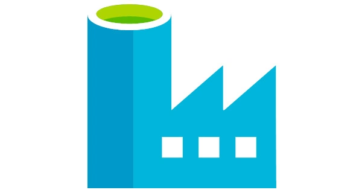
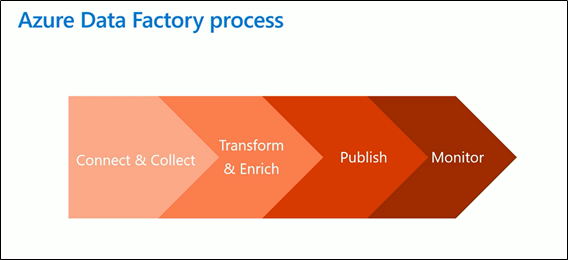
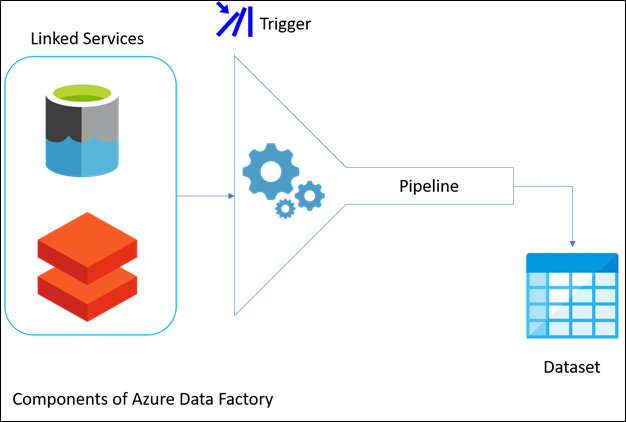

# Appendix A: Azure Data Factory overview

_Azure Data Factory icon_

This article is an introduction to Azure Data Factory (ADF). We are going to describe the main concepts of ADF and its common components.

## What is Azure Data Factory (ADF)

Azure Data Factory is a cloud-based data integration service that allows us to orchestrate and automate data movement and data transformation. As Microsoft's official documentation states, by using ADF, _you can create and schedule data-driven workflows (called pipelines) that can ingest data from disparate data stores. You can build complex ETL processes that transform data visually with data flows or by using compute services such as Azure HDInsight Hadoop, Azure Databricks, and Azure SQL Database_.

ADF will excel on periodic and cold free data rock flows in relying on other azure services, often called from ADF itself for other tasks.

## Azure Data Factory process

These are the different phases that we need to execute in a basic ADF process:

- [Connect & Collect](https://docs.microsoft.com/en-us/azure/data-factory/introduction#connect-and-collect)
- [Transform & Enrich](https://docs.microsoft.com/en-us/azure/data-factory/introduction#transform-and-enrich)
- [Publish](https://docs.microsoft.com/en-us/azure/data-factory/introduction#cicd-and-publish)
- [Monitor](https://docs.microsoft.com/en-us/azure/data-factory/introduction#monitor)

_Azure Data Factory Process_

## ADF Key components

ADF has four key components that work together in the process of transforming the input into output in your dataflow.

They are:

- Datasets: they represent data structures within the data stores.
- Pipelines: a group of activities.
- Activity: it is a processing step in a pipeline that interacts with the datasets.
- [Linked services](https://docs.microsoft.com/en-us/azure/data-factory/concepts-linked-services): they define the information needed for Data Factory to connect to external resources.

There is more information in [this article](https://cloudacademy.com/blog/what-is-azure-data-factory/) and [Microsoft's official documentation](https://docs.microsoft.com/en-us/azure/data-factory/introduction#cicd-and-publish).

_Azure Data Factory Components_

### Apache Spark cluster

As the official documentation states, [Apache Spark](https://docs.microsoft.com/en-us/azure/hdinsight/spark/apache-spark-overview#:~:text=Apache%20Spark%20is%20a%20parallel,Apache%20Spark%20in%20the%20cloud.&text=So%20you%20can%20use%20HDInsight,your%20data%20stored%20in%20Azure.) _is a parallel processing framework that supports in-memory processing to boost the performance of big-data analytic applications. Apache Spark in Azure HDInsight is the Microsoft implementation of Apache Spark in the cloud_.

Apache Spark is one of the tools used in the Transform and Enrich step named above, and will be further discussed in our _Azure Databricks_ article.

## **ADF Integration Runtimes**

The Integration Runtime (IR) is the compute infrastructure used by Azure Data Factory to provide the following data integration capabilities across different network environments:

- **Data Flow**: Execute a Data Flow in managed Azure compute environment.
- **Data movement**: Copy data across data stores in public and private networks (on-premises or virtual private network). It provides support for built-in connectors, format conversion, column mapping, and performant and scalable data transfer.
- **Activity dispatch**: Dispatch and monitor transformation activities running on a variety of computing services such as Azure Databricks, Azure HDInsight, Azure Machine Learning, Azure SQL Database, SQL Server, and more.
- **SSIS package execution**: Natively execute SQL Server Integration Services (SSIS) packages in a managed Azure compute environment.

Types of runtimes:

- Azure integration runtime.
- Self-hosted integration runtime: on-premises data.
- Azure-SSIS: to run SSIS packages into azure.

## ADF components

**Linked services**

They are like connection strings. They connect with two type of resources, Data stores and External compute resources.

**Datasets**

Datasets are data structure inside data store. Depend on linked services. They are used as the data input and output of the activities.

**Examples linking both Linked Services with Datasets**

A linked service point to a SQL Database and the dataset to a table or view of that SQL database. The linked service point to a blob storage when the dataset point to a file inside that storage.

**Triggers**

They are used to setup when a pipeline will run.

[Types](https://docs.microsoft.com/en-us/azure/data-factory/concepts-pipeline-execution-triggers): schedule, tumbling window (run every two hours), event-based (fired responding to an event like creating or deleting a blob file).

**Copy Activity**

The Copy activity allows to copy data among data stores located on-premises and in the cloud. After you copy the data, you can use other activities to further transform and analyze it. You can also use the Copy activity to publish transformation and analysis results for business intelligence (BI) and application consumption. You can find more details by clicking on this [link](https://docs.microsoft.com/en-us/azure/data-factory/copy-activity-overview).

**Parameters and Variables**

They considerably increase the power and flexibility off your pipelines. You can create [custom parameters](https://docs.microsoft.com/en-us/azure/data-factory/parameters-data-flow), or use [system variables](https://docs.microsoft.com/en-us/azure/data-factory/control-flow-system-variables) and [global parameters](https://docs.microsoft.com/en-us/azure/data-factory/author-global-parameters).

[**Debug the pipeline**](https://docs.microsoft.com/en-us/azure/data-factory/iterative-development-debugging)

These features allow you to test your changes before creating a pull request or publishing them to the data factory service. You even can [set breakpoints](https://docs.microsoft.com/en-us/azure/data-factory/iterative-development-debugging#setting-breakpoints) in the activities.

**Data Flows**

Data flows allow data engineers to develop graphical data transformation logic without writing code. The resulting data flows are executed as activities within Azure Data Factory pipelines that use scaled-out Spark clusters. Data flow activities can be operationalized via existing Data Factory scheduling, control, flow, and monitoring capabilities. For more information, check [this link](https://docs.microsoft.com/en-us/azure/data-factory/concepts-data-flow-overview). There are two types: [mapping](https://docs.microsoft.com/en-us/azure/data-factory/concepts-data-flow-overview#what-are-mapping-data-flows) and [wrangling data](https://docs.microsoft.com/en-us/azure/data-factory/wrangling-data-flow-overview) flows.

Data flows run in Azure integration runtime, so the data must be in Azure. The benefit of this is that it is highly scalable. Another important aspect is that they run using Spark clusters.

**Orchestration**

[Monitoring](https://docs.microsoft.com/en-us/azure/data-factory/monitor-using-azure-monitor): we can monitor resources and elements. We can set alerts or create action groups. If something fails, alerts can be sent in form of emails, SMS, or push notifications. ADF analytics is another tool for monitoring our pipelines.

## Summing up

Azure Data Factory allows you to create data-driven workflows that move data (ingest) to the cloud (or on-premise), and after processing through different transformation options (transformation phase), transform it to ready to use information. This article is the starting point for this useful technology.
