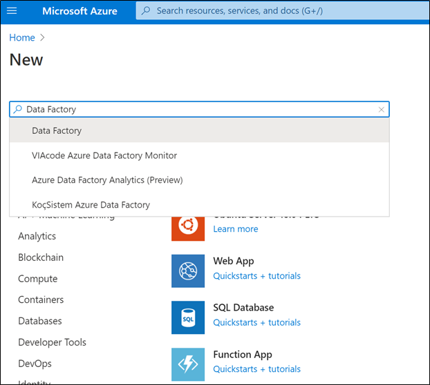
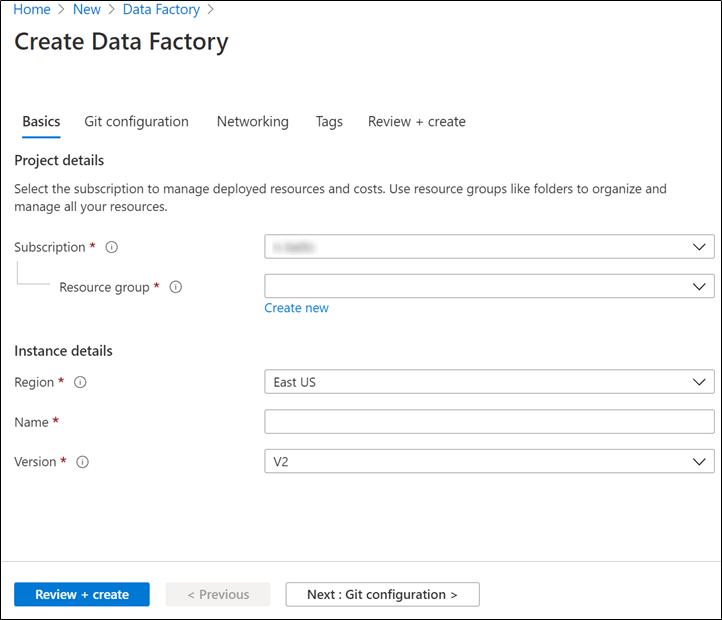
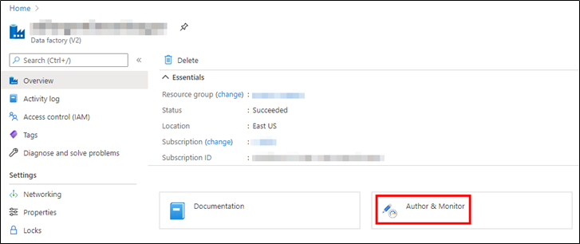

# Module 1 - Creating an Azure Data Factory

The first step in order to create our ingestion pipeline is to create an **Azure Data Factory** service. In this article we will explain you how to do it, if you want to have an overview about Data Factory please check [Appendix A](appendices/A-adf-overview.md).

# Index 📚

- [Creating an ADF](#creating-an-adf)
- [Summing Up](#summing-up)
- [Next Steps](#next-steps-) 🚶

# Creating an ADF

Follow these steps in order to create an ADF.

1. Launch **Microsoft Edge** or **Google Chrome** web browser. Currently, Data Factory UI is supported only in Microsoft Edge and Google Chrome web browsers.
2. Go to the [Azure portal](https://portal.azure.com/).
3. From the Azure portal menu, select **Create a resource**.
4. Write **Data Factory** and press **Enter**.

    

    _Search for Data factory_

5. On the **Create data factory** page, fill in the **Name**.

    

    _Fill the Configuration_

6. For **Subscription**, select your Azure subscription in which you want to create the data factory.
7. For **Resource Group**, use one of the following steps:

   - Select **Use existing**, and select an existing resource group from the list.
   - Select **Create new**, and enter the name of a resource group.

8. For **Version**, select **V2**.
9. For **Region**, select the location for the data factory. The list shows only locations that Data Factory supports, and where your Azure Data Factory metadata will be stored. The associated data stores (like Azure Storage and Azure SQL Database) and computes (like Azure HDInsight) that Data Factory uses can run in other regions, however we recommend to place all the resources in the same region to minimize costs.
10. Select **Review + Create**. After the creation is complete, select **Go to resource** to navigate to the **Data Factory** page.
11. Select the **Author & Monitor** title to start the Azure Data Factory user interface (UI) application on a separate tab.

    

    _Author & Monitor_

>📝 **Note**: 
>
> If you see that the web browser is stuck at "Authorizing", clear the **Block third-party cookies and site data** check box, or keep it selected, create an exception for **login.microsoftonline.com**, and then try to open the app again.

# Summing up

After having completed all these steps, you will be able to start working with **ADF**. In the next module we will show you how to create de **Data Lake storage** needed to store the data.

# Next Steps 🚶

Go to [Creating a Data Lake storage account](../02-data-lake/readme.md)
