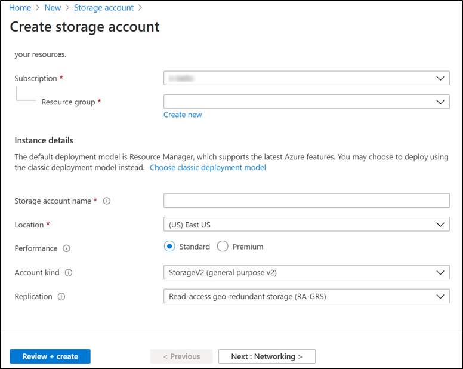
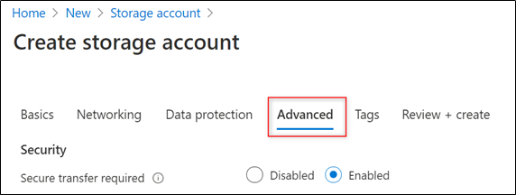
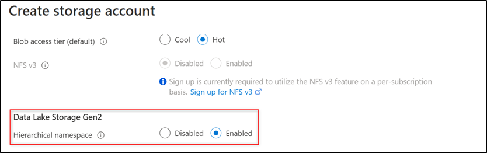

# Module 2: Creating a Data Lake storage account

We will need to create a place to store all the data we will be getting from the external API. We selected **Azure Data Lake** to integrate all the components in the architecture as it is optimized for analytics, rather than using a Blob Storage which is more of a general purpose bulk storage.

# Index 📚

- [Creating a Data Lake storage](#creating-a-data-lake-storage)
- [Summing Up](#summing-up)
- [Next Steps](#next-steps-)🚶

# Creating a Data Lake storage

To create a Data Lake storage you can follow these steps:

1. In the **Azure Portal** click on the **Create a resource** button.
2. Write **Storage Account** and press **Enter**. Then click on the **Create** button to create the resource.

    

    _Fill the Configuration_

3. In the **Basics** tab, fill in all the required information.
4. Click on the **Advanced** tab and search for the **Data Lake Storage Gen2** section and _Enable_ the _Hierarchical namespace_ option.

    

    _Go to Advanced tab_

    

    _Enable the Hierarchical namespace option_

5. Click on the **Review + create** button to create the resource.

# Summing up

At this point we have created our ADF service and the storage account where we will store the data coming from the Football API. In the following articles we will show you how to create the pipeline, how to read the data we get from the API, and how to transform it and save it into our Data Lake storage.

# Next Steps 🚶

Go to [Consuming APIs with ADF](../03-api/readme.md)
