# Module 3 - Consuming APIs with ADF

In the beginning, when we were looking for the topic of our integration exercise, we found several free APIs related to different subjects. After studying different options and the information returned by the APIs, we decided to continue with the [TheSportsDB](https://www.thesportsdb.com/) API. In this section we will show you how to create the ingestion pipeline.

# Index 📚

- [The football API](#the-football-api)
- [Creating the ingestion pipeline](#creating-the-ingestion-pipeline)
  - [Creating the connection to the storage resources](#creating-the-connection-to-the-storage-resources)
  - [Creating the intermediate datasets](#creating-the-intermediate-datasets)
  - [Creating the copy activities](#creating-the-copy-activities)
- [Summing up](#summing-up)
- [Next Steps 🚶](#next-steps-)

# The football API

As stated on its website, the [TheSportsDB](https://www.thesportsdb.com/) is an open, crowd-sourced database of sports artwork and metadata with a free API. It has information on different sports like football, the NBA, the NFL and more. Regarding football information, it contains data about different leagues all around the world like the English, Spanish, Argentinean, among several others.

Therefore, we decided to use the information returned by this API for the _Spanish Football League_ (also known as _La Liga_) as our main data-source.

>📝 **Note:**
>
> If you want to learn more about this API's content, you will find all the information related to the available endpoints [here](https://www.thesportsdb.com/api.php).

# Creating the ingestion pipeline

In the following sections, we will explain how we created the ingestion pipeline. At this point we have already created the ADF service and the storage account. We are going to need different resources in order to read, copy and transform the data after saving it into the _Data Lake_. In this article we will explain how to create the copy activities and the intermediary datasets.

## Creating the connection to the storage resources

To create the connection to the _Data Lake_ storage and to the REST APIs, we need to create what is called a **Linked Service**.

>📝 **Note:**
>
> If you want to know more about what a _Linked Service_ is you can check [Microsoft's documentation](https://docs.microsoft.com/en-us/azure/data-factory/concepts-linked-services).

Here we will show you how to create the linked services we will need to make our pipeline work.

1. In the **Azure Portal** go to the ADF service you created in the first module and click on the **Author & Monitor** button.

    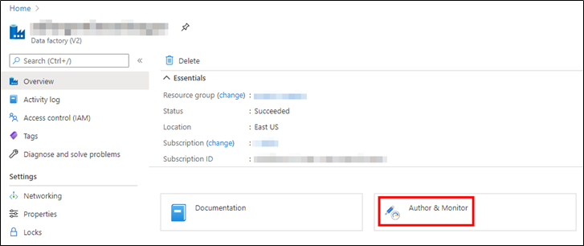

    _Author & Monitor_

2. In the ADF portal, click on the **Manage** button and then click on the **+ New** button.

    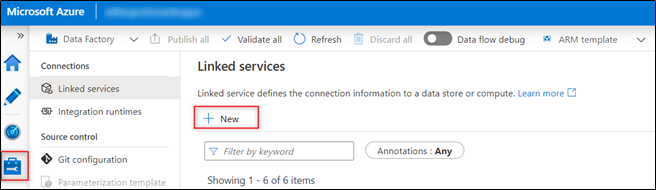

    _Add new linked service_

3. We are going to create the connection to the first API endpoint, the one returning the next **15 events** of the league. To do this, write **`rest`** in the search box and select the REST option and click on the **Continue** button.

    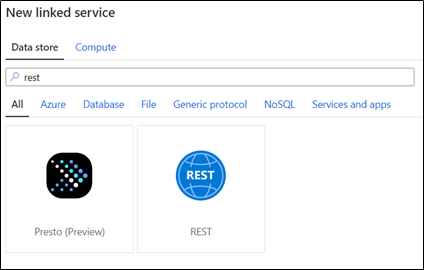

    _Select the REST option_

4. Fill in the required information like **Name**. In **Base URL** copy and paste the following URL: https://www.thesportsdb.com/api/v1/json/1/eventsnextleague.php?id=4335. Because the **TheSportsDB** API is free and open, you don't need to authenticate, so for the **Authentication type** you can select the **Anonymous** option. Test the connection and if everything is OK, click on the **Create** button.

    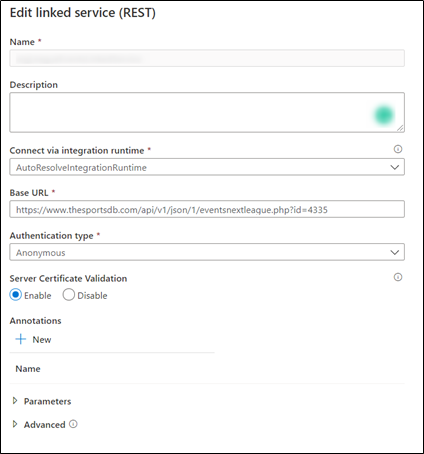

    _Fill in the Information_

5. Repeat the steps 3 and 4 to create the _Linked Service_ connection to the API method that returns the teams' information. For the **Base URL** field you should paste the following URL: https://www.thesportsdb.com/api/v1/json/1/search_all_teams.php?l=Spanish%20La%20Liga

6. Now we need to create the _Linked Service_ connection to the _Data Lake_ we created in the [Module 2](../02-data-lake/readme.md#creating-a-data-lake-storage). To do this, click on the **+ New** button and search for the Azure **Data Lake Storage Gen2** option. Click on the **Continue** button.

    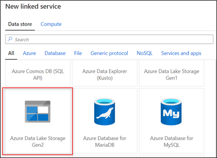

    _Select the Azure Data Lake Storage Gen2 option_

7. Fill in the **Name** field, select your **Azure subscription**, and in the dropdown list called **Storage account name**, look for the name you used in the Module two of this workshop.

8. Test the connection and if everything worked OK click on the **Create** button.

With the three connections created we can continue on with the copy activities.

## Creating the intermediate datasets

When you are working with data in ADF, you will need different storages in order to save temporary data. These storages can be of any of the types supported by ADF. In this section we will show you how to create the ADF datasets that will help us in the ingestion and transformation of the data.

We will be using:

- Two input datasets in order to read the data from the teams and event APIs.
- Two intermediate output datasets in order to store the information we read from the input datasets in CSV format.
- One final output dataset to store the merged information we stored previously.

>📝 **Note:**
>
> In order to unify the used file formats in the app we arrived to the conclusion of employing only **CSV**
> all across it.
> - One strong reason for this decision was that Stream Analytics (another main component of
> the solution) presented problems deserializing Avro format and did not accept Parquet inputs (neither
> Parquet streaming inputs nor Parquet reference inputs).
> - Also, we were not able to read Avro files
> with our C# app that ingests streaming content from Twitter.
>
> Nevertheless, these two formats (Avro & Parquet) tend to suit very well for Data Engineering scenarios like
> this. Indeed, we analyzed and implemented them in successful spikes with the rest of the components
>  (incluiding Data Factory). Here is a quick overview of them:
>
> **Parquet**:
> - Is a column-based format, and it is better to use it when you only need to access specific fields.
> - It cannot be written from streaming data since it needs to wait for blocks to get finished.
> - It is better for data exploration (read intensive, complex or analytical querying, low latency data).
> - The bigger the volume, the better Parquet performs against Avro (both in time & size).
>
> **Avro**:
> - Is a data serialization system, relying on schemas and being row-oriented format.
> - In the streaming branch of our application, data is continuously arriving, row per row,
> and we are interested in all columns from each row (without filtering). This is a point for Avro.
> - Avro is compatible with multiple tools and languages. That is very useful in our case where we are
> integrating it with a Data Lake for later consumption with other tools. However, we encountered the
> mentioned problems regarding this topic.

To create the datasets we will need follow these steps:

1. In the ADF dashboard click on the **Author** button.

2. Select the **Datasets** subfolders and select the **Actions** button. Click on the **New dataset** option.

    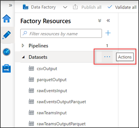

    _Create New Dataset_

3. In this step we will create the input dataset that will manage the connection with the REST API. So, click on the **New dataset** action button and write rest. Click on the **REST** option and click on the **Continue** button.

    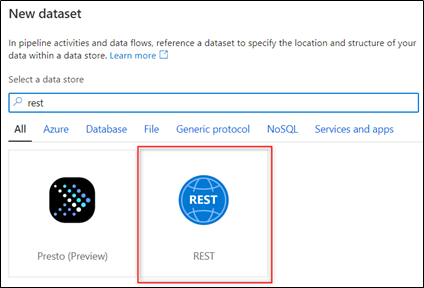

    _Select the REST option_

4. Fill in the **Name** field. As we are creating the dataset that will contain the events data, we will be using the _Linked Service_ we have created in the steps three and four of the [Creating the connection to the storage resources section](#creating-the-connection-to-the-storage-resources). So, look for it in the **Linked service** dropdown list. Test the connection and if everything works OK you are done with this step.

    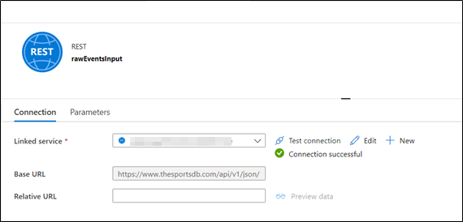

    _Configure Dataset Settings_

5. Repeat the previous step in order to create the input dataset but for the teams. For this case, you should select the linked service we created in the step five of the [Creating the connection to the storage resources](#creating-the-connection-to-the-storage-resources) section.

With the steps above we have created the input datasets, now we need to create the output ones. These datasets will store the data coming from the input datasets, and they are going to be CSV datasets instead. Follow these steps to create them:

1. Repeat the steps one and two of this section.

2. Click on the **New dataset** action button and select the **Azure Data Lake Storage Gen2** option and click on the **Continue** button. Select **CSV DelimitedText** as the output format and click on the **Continue** button.

    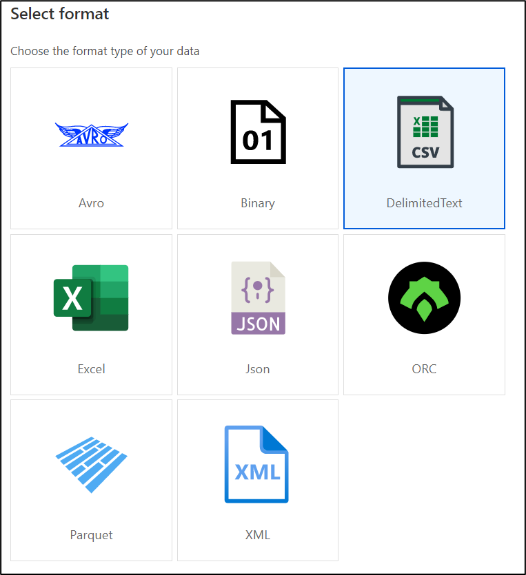

    _Select the CSV option_

3. This dataset will be used to store the events' raw data, so fill in the **Name** accordingly. Similar to the steps we followed when we created the **REST** datasets, you should look for the connection we created in the step number six of the [Creating the connection to the storage resources section](#creating-the-connection-to-the-storage-resources).

4. In the **File path** fields you should insert the names of **the folder** where the data will be stored / **the subFolder / the name of the output file** (don't forget to introduce the extension that in this case will be _.csv_). The rest of the options should be left in the default values.

    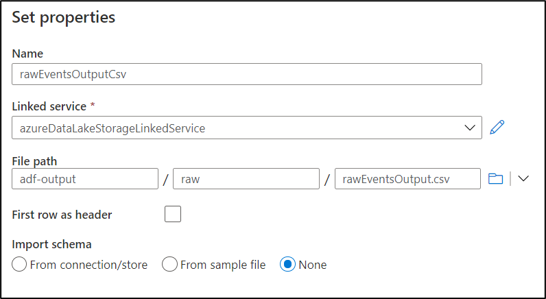

    _Configure CSV Dataset Settings_

    >📝 **Note:**
    > At this stage, we haven't imported the schema to output dataset yet. We will solve it by
    > creating our pipeline and then using the intermediate output files to obtain the schema.

5. Repeat the steps three and four in order to create the output _Data Lake_ dataset for the raw data of the teams. Use the connection we created in the step number six of the [Creating the connection to the storage resources](#creating-the-connection-to-the-storage-resources) section for the **Linked service** dropdown list.

    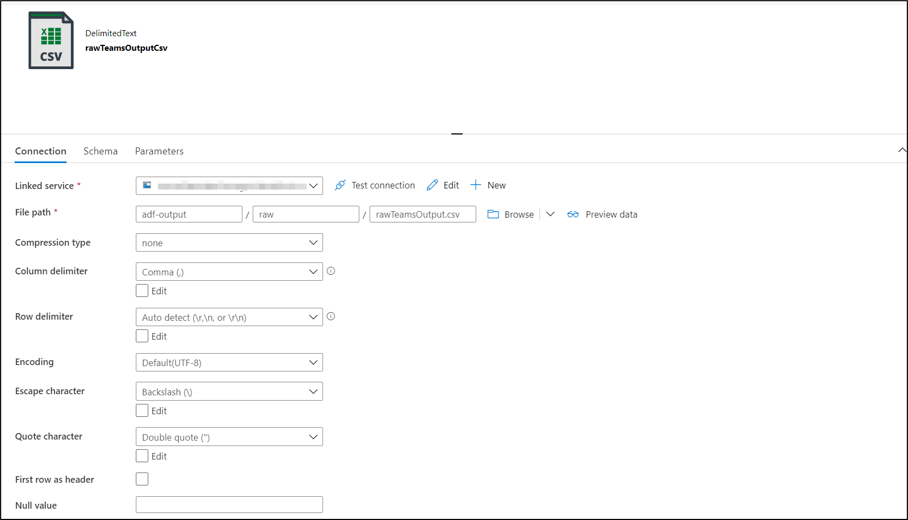

    _Configure Dataset Settings_

6. Repeat again the step five above in order to create the dataset that will hold our pipeline's final output. Use the same _Linked Service_ connection we used previously. The rest of the options should be left in the default values.

    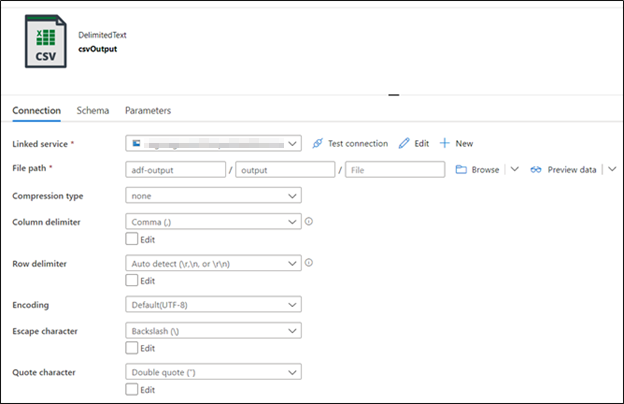

    _Configure CSV Output Dataset Settings_

We are all set! Let's continue with the rest of the resources needed for our pipeline to run.

## Creating the copy activities

To read and copy the events and teams information, we will use a copy activity. If you want to learn more about copy activities, you can read the official documentation by clicking on the next [link](https://docs.microsoft.com/en-us/azure/data-factory/copy-activity-overview).

In this section we will start creating the pipeline, and we will add two new copy activities: 1) We will read the data from the events API and will copy it to the corresponding output dataset, 2) We will read the data from the teams API and will copy it to the teams output dataset.

To create a pipeline follow these steps:

1. In the ADF dashboard click on the **Author** button.
2. Select the **Pipelines** subfolders and select the **Actions** button. Click on the **New pipeline** option.
3. Fill in the **Name** field.

Now that we have created the pipeline, we can add the copy activities, please, follow the next steps to make it:

1. Click on the pipeline you created above. In the activities panel, in the **Move & transform** section, drag a **Copy data** activity.

    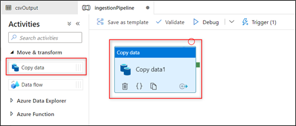

    _Add a Copy data activity_

2.  This activity will copy the events' data from the input dataset to the corresponding events' output dataset. To configure it, in the **General** tab, fill in the **Name**.

3.  Select the **Source** tab to configure the input dataset. For the **Source dataset** dropdown list, search for the dataset we created in the step three of the [Creating the intermediate datasets](#creating-the-intermediate-datasets) section. The rest of the configurations should be left in the default values.

    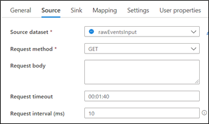

    _Configure Activity Source Settings_

4. Select the **Sink** tab and for the **Sink dataset** you should select the dataset we created in the step two of the [Creating the intermediate datasets](#creating-the-intermediate-datasets) / _Output datasets_ section.

    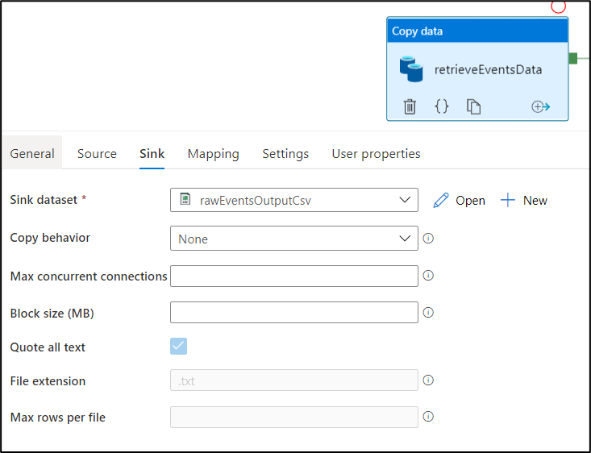

    _Configure Activity Sink Settings_

5. By clicking on the pipeline, create a new copy activity. This activity will copy the teams' data from the input dataset to the corresponding teams' output dataset. To configure it, in the **General** tab, fill in the **Name**.

6. Select the **Source** tab to configure the input dataset. For the **Source dataset** dropdown list, search for the dataset we created in the step six of the [Creating the intermediate datasets](#creating-the-intermediate-datasets) section. The rest of the configurations should be left in the default values.

    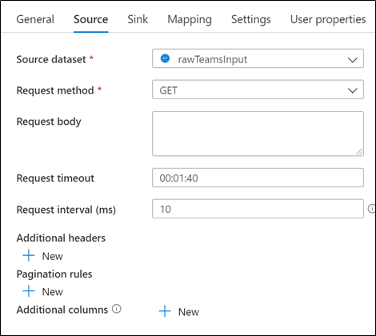

    _Configure Activity Source Settings_

7. Select the **Sink** tab and for the **Sink dataset** you should select the dataset we created in the step five of the [Creating the intermediate datasets](#creating-the-intermediate-datasets) section.

    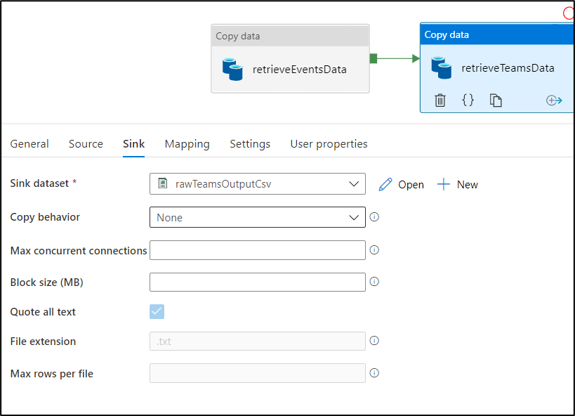

    _Configure Activity Sink Settings_

8. Then join both copy activities. The pipeline should look similar to the image below.

    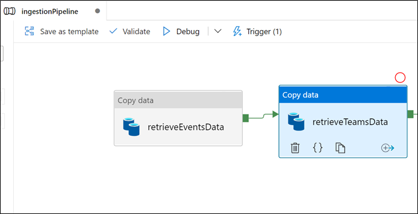

    _Join Activities_

9. Now, let's run the current pipeline in order to generate the CSV files that will let us import the dataset schemas. Click the *Trigger (1)* button, then *Trigger now* and *Ok*:

    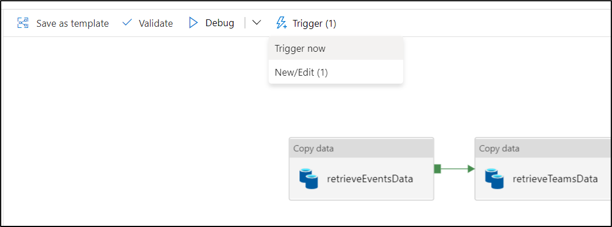

    _Trigger Pipeline_

10. Once the pipeline has finished, you will find two CSV files in your storage with the data retrieved from the API.

    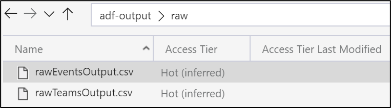

    _Pipeline output in the Storage_

11. Open them and add a new first line as header with the corresponding categories from the mapping inside each copy activity in the pipeline. Here, we illustrate this only for Events, but you should do it also for Teams data.

    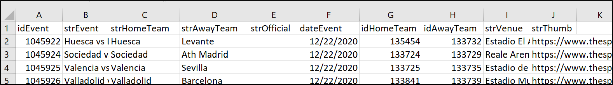

    _Edit the files adding its header_

    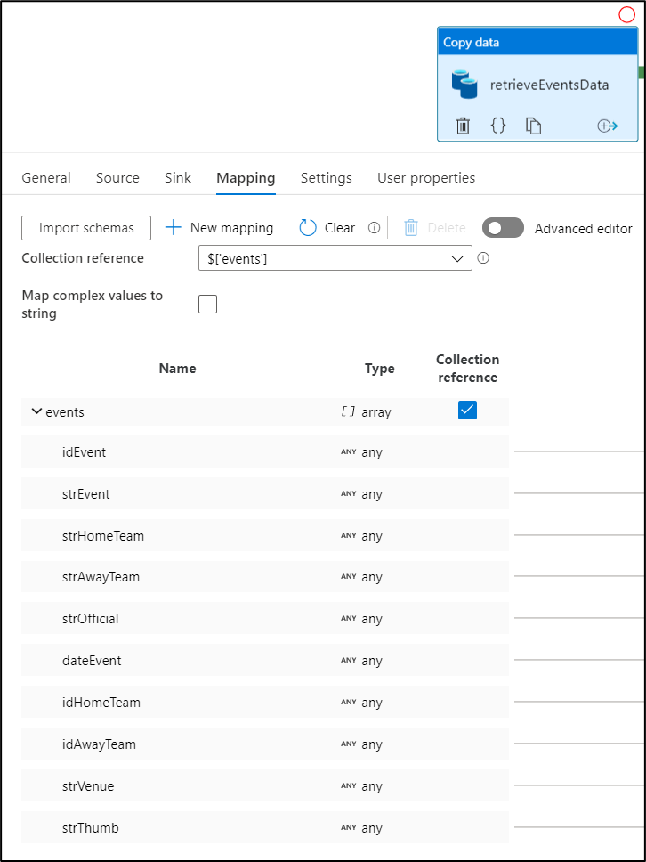

    _Corresponding categories to be used as header names (for Events data)_

12. Finally, in the dataset configuration go to the *Schema* tab, click *Import schema*, then *From sample file* and search for your edited file.

    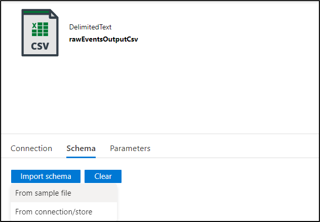

    _Edit the files adding its header_

13. As a result, your schema should be recognized and shown.

    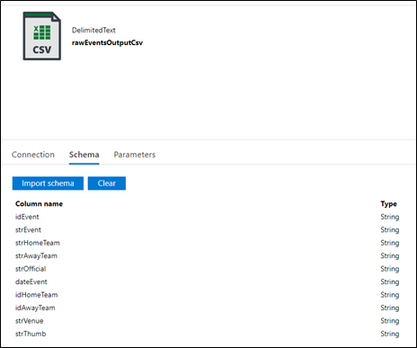

    _Edit the files adding its header_

14. Repeat steps 10 to 13 for the Teams data.

# Summing up

At this point, we have created the ingestion pipeline, the intermediate datasets, and the copy activities that ingest the information coming from the external APIs into our internal data storages. The next step is to create the dataflow that will merge the data from the two APIs, and will provide the information needed for the next stages of the workshop.

# Next Steps 🚶

Go to [Creating the merging dataflow](../04-data-flow/readme.md)
