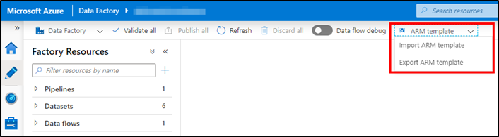
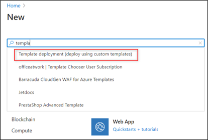
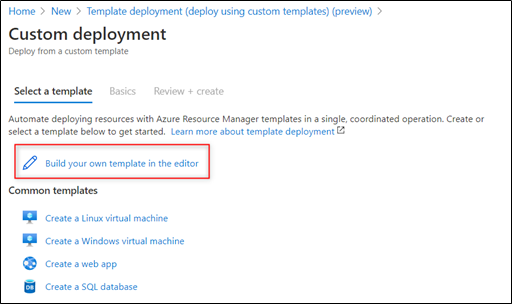
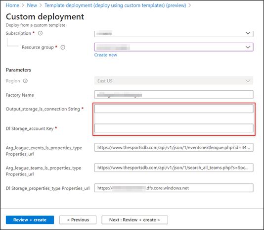
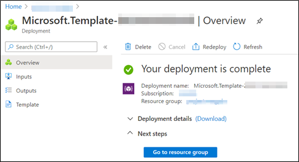

# Appendix B: Backup/Restore an ADF

In this article, we will explain how to restore an ADF service using an ARM template.

## **What is an ARM template?**

To implement the infrastructure as code in your Azure solutions, you can use the **Azure Resource Manager** or ARM. The ARM is a JSON file that defines the infrastructure and configuration of a project. In this file, you specify the resources to deploy and the properties of those resources. For more information, you can check [this link](https://docs.microsoft.com/en-us/azure/azure-resource-manager/templates/overview). Additionally, you can watch [this video](https://www.youtube.com/watch?v=Ge_Sp-1lWZ4) for more information and examples of ARM templates.

## **Exporting an ADF's ARM**

To export the ARM of an existing ADF service, you can follow these steps:

1. Go to your ADF resource and click on the **Author & Monitor** button.
2. Click on the option **Author** at the top left.
3. In the ADF dashboard, click on the **ARM template** dropdown list and select the **Export ARM template** option.

    

    _ARM template dropdown_

## Restoring the ADF service

Once you exported the ARM of the ADF service and you want to restore it follow the next steps:

1. Create a new ADF factory service.
2. In the **Azure Portal**, select **Create resource**, and then select the **Template deployment** option.

    

    _Create Template deployment_

3. Click on the **Build your own template in the editor** button.

    

    _Click "Build your own template in the editor" button_

4. When you exported the ARM, several files were downloaded in a zip file. We used the one named **arm_template.json**. Copy the content of that file and replace the one in the editor.
5. In the **parameters** section of the JSON, you copied, change the name of the **factoryName / defaultValue** object for the name of the new data factory service you created in the first step. Click on the **Save** button.
6. Finally, fill in the required data like connection strings, resource group, or data-sources keys. Click on the **Review + create** button.

    

    _Configure the Parameters_

7. If everything worked ok, you will see a message similar to this one.

    

    _Successful deployment_

## Summing up

These are the steps we followed to restore an ADF service from an ARM template. In case of issues during the deployment, you can check [this documentation](https://docs.microsoft.com/en-us/azure/azure-resource-manager/templates/common-deployment-errors).
