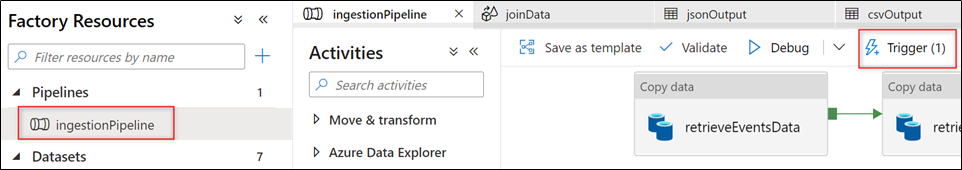
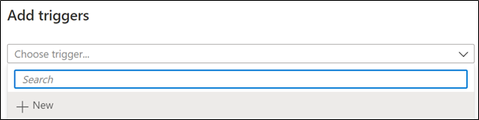
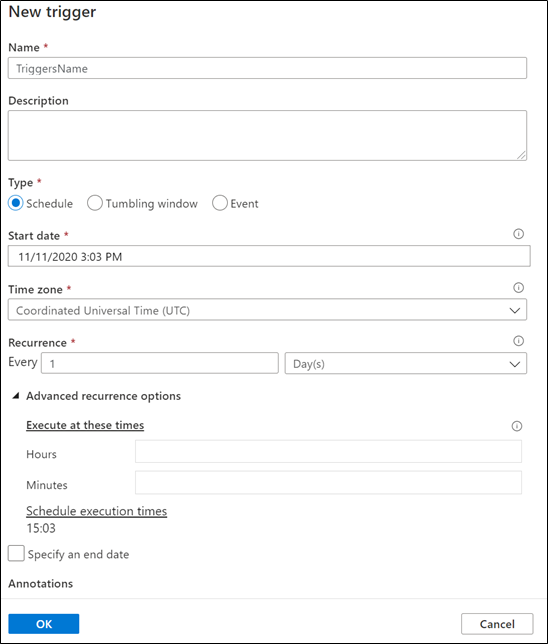
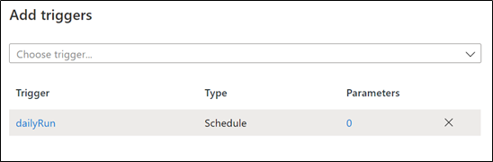

# Appendix C: How to configure a trigger

You can execute a pipeline by running it manually or by schedule, here is when triggers come in hand. There are three kinds of triggers in ADF:

- Schedule trigger: it will run at a specific time.
- Tumbling window trigger: these kinds of triggers run on a periodic interval.
- Event-based trigger: it will run as a response to an event.

## Setting up a scheduled trigger

In order to create a trigger, you can follow the next steps:

1. Select the pipeline and then click the **Trigger** button. Then select the **New/Edit** option.

    

    _Click the Trigger button_

2. In the **Add triggers** tile, click on the **Choose trigger...** dropdown list and select **New**.

    

    _Add New Trigger_

3. Insert the **name** and choose the type. In this article, we are going to create a Scheduled trigger, so we selected the **Schedule** option. Next, we selected the starting-date, and the time it will run. Finally, we selected the recurrence type (every N minutes, hourly, daily, weeks, and months), and we activated it by selecting **Yes** for the **Activated** option. Click on the **OK** button to create the trigger.

    

    _Configure the Trigger_

4. After clicking **OK** the trigger will appear in the **Add triggers** tile.

    

    _Trigger already added_

You can delete the trigger by clicking the **X** button, or edit the trigger configurations by clicking the trigger's name.
