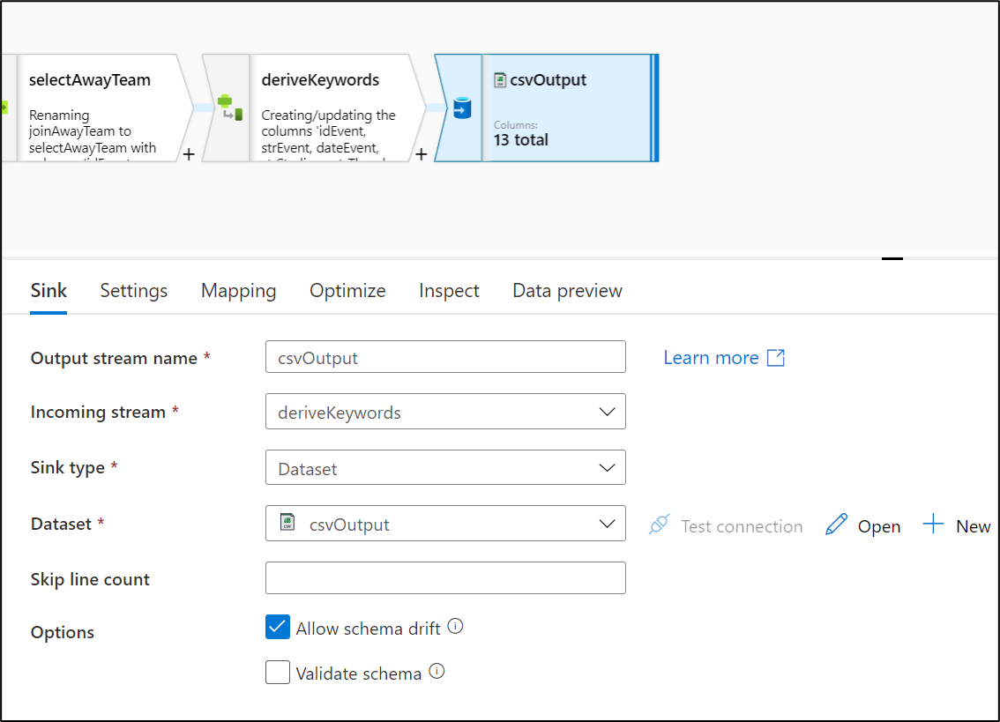

# Module 4 - Creating the merging dataflow

Once we have the data from the API ingested and stored in the _Data Lake_, we will proceed to add a new joining activity in our ADF pipeline.

# Index 📚

- [Adding a Joining Data Flow](#adding-a-joining-data-flow)
- [Summing up](#summing-up)
- [Next Steps 🚶](#next-steps-)

# Adding a Joining Data Flow

This activity will be a **Data Flow** which enables us to include several steps inside of it, and we will use it to combine the information from the two previous branches (events and teams).

To create this new Data Flow, we will follow the following steps:

1. Click on _Data Flows_ tile (**Actions** button) and select **New mapping dataflow**.

    

    _Add New mapping dataflow_

2. Select **Data flow** and click **Ok**. Then, you can give it a name, for example **joinData**.

    

    _Create New Data Flow_

3. You can start by adding two sources, one for each endpoint ingested from the API.

    

    _Add Sources_

4. Configure the events source settings according to the following settings.

    

    _Configure the Events source_

5. Then, configure the Teams source settings.

    

    _Configure the Teams source_

6. Moving on, we are ready to join the two sources. Select the plus sign (**+**) on the **rawEventsSource** and click the **Join** element.

    

    _Add Join operation_

7. We will perform two consecutive joining processes, first we define an inner join based on the **Home Team Id** (from the Events source) matching with any **Team Id** from the **Teams source**.

    

    _Configure Join operation_

8. After each join, we will need a **select** operation. This is needed in order to only keep processing the information useful for this application, the API retrieves several other fields not as important as the ones we will select here. Click the plus sign (**+**) after the joinHomeTeam.

    

    _Add Select operation_

9. Next, configure the select operation according to this settings below:

    

    _Configure Select operation_

10. Now, we are going to repeat steps 6 through 9 for joining the _Away Teams_. Here is the configuration for the inner join with away teams and the selected columns.

    

    _Add Join operation for Away Teams_

    

    _Add Select operation for Away Teams_

11. The next step in this _Data Flow_ is to generate another column based on the selected ones. This column will contain every useful keyword to be used later on in the _Databricks_ stage to retrieve tweets based on these words. We will add a **Derived Column** operation.

    

    _Add Derived Column operation_

12. The configuration of this operation will be according to this setting, in which we will create the `keywords` column by entering this expression:

    ```raw
    concatWS(',', strEvent, strStadium, strReferee, homeTeamName, awayTeamName)
    ```

    

    _Configure Derived Columns operation_

13. As a last step, we need to save the obtained joined data into a sink. In the **+** sign from the **derivedKeywords** add a **Sink** destination:

    

    _Add Sink destination_

14. Then, add the CSV output sink with this configuration:

    

    _Add Sink destination (CSV ouput)_

    

    _Configure CSV output_

15. The Data flow is finished, here is the overall look:

    

    _Snapshot of the complete Data Flow_

16. Now, in the Pipeline view, you can use the search box for adding a new _Data Flow_, and then choose the newly created **joinData** activity. Finally click **Ok**.

    

    _Add Data Flow to previous Pipeline_

17. Finally, you can add this new activity to your existing pipeline.

    

    _Data Flow added to previous Pipeline_

>📝 **Note**:
>
> It is possible to set a trigger that will execute the pipeline after a defined event. For more information please visit [this appendix](./appendices/C-configure-trigger.md).

>💡 Hint:
>
> If you want to keep a backup of your pipeline to protect it against unexpected deletions or mistakes you can see how to backup in [this appendix](./appendices/B-backup-restore.md).

# Summing up

After this module, we have our ADF fully configured. We can move on to the next stage to consume the ingested data.

# Next Steps 🚶

Go to [Module 5 - ACI Application](../05-aci-application/readme.md)
