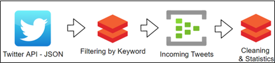
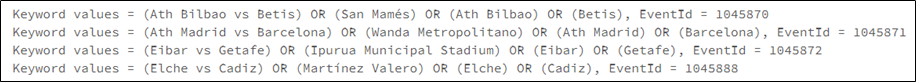
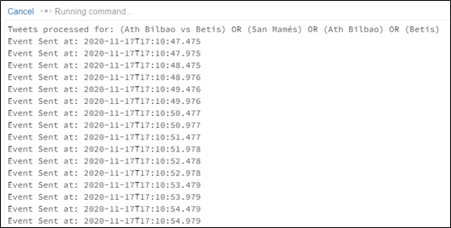
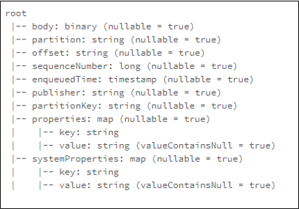
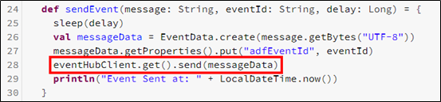
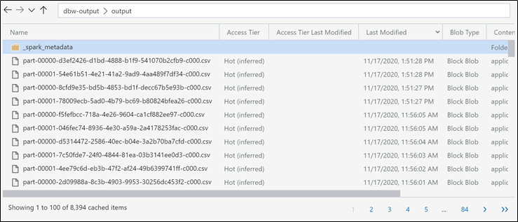

# Twitter and Databricks integration

We saw in [this module](../readme.md) how to implement the interface with the _Twitter_ API using a _C#_ application deployed to _Azure Container Instance (ACI)_, however, during our first steps developing the application that task was accomplished using a _Databricks Notebook_ as suggested in the [Microsoft Tutorial](https://docs.microsoft.com/en-us/azure/databricks/scenarios/databricks-stream-from-eventhubs). We believe it is important to leave this experience documented for further review, so in this appendix we will see how to use Databricks to read the output generated by Data Factory which contains information of the events found in the API and the keywords to perform searches, also we will integrate _Azure Databricks_ with _Twitter API_ in order to obtain the tweets associated to every keyword of every event, we will use an _Event Hub_ Instance to serialize data for cleansing and transformation. At the end we will be generating an output of processed tweets for the Stream Analytics stage.

It is worth to mention that this implementation uses two _Notebooks_: one fetches tweets and pulls them into an Event Hub queue, the other one reads from _Event Hub_ to make some cleansing and transformation. The second _Notebook_ could be the one that we will see in [Module 06](../../06-text-classification/readme.md) is implementing _Text Classification/Language Detection/sentiment Analysis_, also, this implementation lacks the part where keywords coming from the _Data Factory_ are processed against the variants to improve the accuracy of the tweets search.



_Architecture of Databricks and Event Hub interfacing with the Twitter API_

# Index 📚

- [Prerequisites](#prerequisites)
- [The Databricks Workspace](#the-databricks-workspace)
- [Creating the notebooks 📒](#creating-the-notebooks-)
  - [Send tweets to Event Hub ➡️](#send-tweets-to-event-hub-️)
    - [Building the connection](#building-the-connection)
  - [The Event Hub](#the-event-hub)
  - [Anatomy of an Event Hub message](#anatomy-of-an-event-hub-message)
  - [Read tweets from Event Hub ⬅️](#read-tweets-from-event-hub-️)
- [Summing up](#summing-up)

# Prerequisites

At this point we need the following things, although we are likely to have them from the module about the ACI Application:

- An Azure subscription
- A Data Lake Storage Account
- The output.json generated by the Data Factory
- A Twitter Developer account

# The Databricks Workspace

This part of relies on the power of _Databricks_ and _Event Hub_ combined, we will create two Notebooks: One will read the events information from _Data Factory_ and integrate with the Twitter API and other to clean and transform the data.

Setting up a workspace to work with _Databricks_ was already covered in this workshop, if you've been following the workshop sequentially you could reuse the workspace that you have, otherwise please refer to that section for how to create the necessary elements before proceeding:

- Go [here](https://docs.microsoft.com/en-us/azure/databricks/scenarios/quickstart-create-databricks-workspace-portal?tabs=azure-portal#create-an-azure-databricks-workspace) to see how to setup the _Databricks_ workspace.
- Go [here](https://docs.microsoft.com/en-us/azure/databricks/clusters/create) to see how to launch a Cluster.
- Go [here](https://docs.microsoft.com/en-us/azure/databricks/notebooks/notebooks-manage#create-a-notebook) to see how create a Notebook.

# Creating the notebooks 📒

As we have mentioned we will be using 2 Notebooks: One to interact with **Data factory** and the Twitter API and other to clean and transform data. At this point you will need to have access to a Twitter developer account, if you haven't created your account please refer to [this section](https://docs.microsoft.com/en-us/azure/databricks/scenarios/databricks-sentiment-analysis-cognitive-services#create-a-twitter-application) to see how you can do it.

>📝 **Note**:
>
> We based this tutorial on [this](https://docs.microsoft.com/en-us/azure/databricks/scenarios/databricks-stream-from-eventhubs) Microsoft article, please refer to it for the original code and steps

## Send tweets to Event Hub ➡️

Let's create a Notebook to read the events information from Data Factory and then search for related tweets.

1. Create a new Notebook in your workspace and name it **SendEventsToEventHubs**
2. We will need to access the shared Data Lake so to mount it we first will use a Key Vault to access the keys, place the following code in a cell replacing **SECRET_SCOPE** and **SECRET_KEY** with the corresponding values:

    ```scala
    val configs = Map (
      dbutils.secrets.get(scope = "SECRET_SCOPE", key = "SECRET_KEY") ->
      dbutils.secrets.get(scope = "SECRET_SCOPE", key = "SECRET_KEY")
    )
    ```

>📝 **Note**:
>
> Observe that we're using a Key Vault to store sensitive information here, please refer to the [secret scopes](https://docs.microsoft.com/en-us/azure/databricks/security/secrets/secret-scopes) section of the Azure Databricks official documentation for guidance as how to use the Key Vault, you must have the Key Vault and parameters set and added the scope to Databricks to be able to use the preceding code.

3. Now we need to mount the Data Lake in our Cluster, paste the following code in a new cell replacing **OUTPUT_FOLDER**, **INPUT_FOLDER** and **STORAGE_ACCOUNT** with the corresponding values:

    ```scala
    var outputPath = "/mnt/output"
    var inputPath = "/mnt/input"

    if (!dbutils.fs.mounts.map(mnt => mnt.mountPoint).contains(outputPath))
      dbutils.fs.mount(
          source = "wasbs://OUTPUT_FOLDER@STORAGE_ACCOUNT.blob.core.windows.net/",
          mountPoint = outputPath,
          extraConfigs = configs
      )

    if (!dbutils.fs.mounts.map(mnt => mnt.mountPoint).contains(inputPath))
      dbutils.fs.mount(
          source = "wasbs://INPUT_FOLDER@STORAGE_ACCOUNT.blob.core.windows.net/",
          mountPoint = inputPath,
          extraConfigs = configs
      )
    ```

4. Observe from previous cell that we have defined two different folders in the Data Lake: One for the output of Data Factory with the sporting events info, and another for the output of Databricks with the tweets data. The Stream Analytics will read the generated files from both locations to fill the Power BI dataset.
5. Now we're able to read the Data Factory output from the Data Lake (**inputPath**), a JSON file is placed there containing an array of events, each event contains a set of keywords associated to it to search in Twitter and the EventId, we have to process that set of keywords to generate an array, we do that with the following code in a different cell:

    ```scala
    import scala.collection.mutable.ArrayBuffer

    class Keyword(var values: String, var eventId: String) {
     def print = println(s"Keyword values = $values, EventId = $eventId")
    }

    val keywordsPath = inputPath + "/output/output.parquet"

    // Read data from parquet file
    var parquetData = spark.read.parquet(keywordsPath)

    // Register the DataFrame as a temporary view
    parquetData.createOrReplaceTempView("keywords")

    // Obtain rows
    var parquetRows = spark.sql("SELECT keywords, idEvent FROM keywords")
    var parquetRowsCount = parquetRows.count().toInt

    var keywordsArray = new ArrayBuffer[Keyword](parquetRowsCount)

    parquetRows.collect().foreach { row =>
      var keywords = row.get(0).toString
      var eventId = row.get(1).toString
      var keywordsSplited = keywords.split(",")
      var keywordsSplitedSize = keywordsSplited.size
      var index = 0
      var queryResult = ""
      keywordsSplited.foreach { keyword =>
        var temp = ""
        if (!keyword.isEmpty) {
          if (index < keywordsSplitedSize - 1) {
            temp = "(" + keyword + ") OR "
          } else {
            temp = "(" + keyword + ")"
          }
          queryResult += temp
        }
        index += 1
      }
      var twitterKeywords = new Keyword(queryResult, eventId)
      keywordsArray += twitterKeywords
    }

    for (keyword <- keywordsArray) {
      keyword.print
    }
    ```

6. This cell will generate an array of objects (Class: Keyword) with two values: Keyword and EventId:

    

    _View of the keywords array generated_

### Building the connection

The array generated with the previous code will be iterated in the **main block cell** which calls the Twitter API for each set of keywords in the array to then send the results to Event Hub. We won't show the entire code here as it is large, you can access the whole code for this Notebook [here](./code/SendEventsToEventHubs.scala). But we will explain the main functionalities:

1. To make the connection with Event Hubs, we need to declare the namespace name, the Event Hub name, the SAS key name and value.

    ```scala
      val namespaceName = "eventhub-integration-dev"
      val eventHubName = "twitter-eh"
      val sasKeyName = "twitter-access"
      val sasKey = dbutils.secrets.get(scope = "stdlintegrationdev-secret-scope", key = "sasKeyEventHubs")
      val connStr = new ConnectionStringBuilder()
                  .setNamespaceName(namespaceName)
                  .setEventHubName(eventHubName)
                  .setSasKeyName(sasKeyName)
                  .setSasKey(sasKey)
    ```

2. Define two functions: **sleep**, and **sendEvent**, the first function sleep the process for period of time given by the parameter time in milliseconds, and the second one send the tweet processed to Event Hubs.

    ```scala
      def sleep(time: Long): Unit = Thread.sleep(time)

      def sendEvent(message: String, eventId: String, delay: Long) = {
        sleep(delay)
        val messageData = EventData.create(message.getBytes("UTF-8"))
        messageData.getProperties().put("adfEventId", eventId)
        eventHubClient.get().send(messageData)
        println("Event Sent at: " + LocalDateTime.now())
      }
    ```

3. Declare the twitter keys, secrets and tokens generated previously ([see post here](https://docs.microsoft.com/en-us/azure/databricks/scenarios/databricks-sentiment-analysis-cognitive-services#create-a-twitter-application)).

    ```scala
    val twitterConsumerKey = "**REPLACE WITH CONSUMER KEY**"
    val twitterConsumerSecret = "**REPLACE WITH CONSUMER SECRET**"
    val twitterOauthAccessToken = "**REPLACE WITH ACCESS TOKEN**"
    val twitterOauthTokenSecret = "**REPLACE WITH TOKEN SECRET**"
    ```

4. Set two constants: **queryCount** and **threadSleepTime**, the first constant is used to determinate the number of tweets to obtain from Twitter API, and the second one is used in the function **sendEvent**.

    ```scala
      val queryCount = 50
      val threadSleepTime = 500
    ```

5. And then, we will find the main block of code, it is in charge of reading the array of keywords and sending the events:

    ```scala
      while (true) {
        for (keyword <- keywordsArray) {
          val query = new Query(keyword.values)
          query.setCount(queryCount)
          query.lang("en")
          val result = twitter.search(query)
          val statuses = result.getTweets()
          var lowestStatusId = Long.MaxValue
          for (status <- statuses.asScala) {
            val tweetString = DataObjectFactory.getRawJSON(status)
            sendEvent(tweetString, keyword.eventId, threadSleepTime)
            lowestStatusId = Math.min(status.getId(), lowestStatusId)
          }
          query.setMaxId(lowestStatusId - 1)
        }
      }
    ```

6. Finally, we close connection to the Event Hub

    ```scala
    eventHubClient.get().close()
    ```

7. Here, we can see the console output of this first notebook:

    

    _View of the debug timestamps printed on each tweet sent to EventHub_

Observe that we are neglecting here if a given tweet is processed multiple times, in fact, if you stop and start this _Notebook_ in a short period of time, chances are that you will get the same tweets from the API. In [this appendix](./B-tweets-processed.md) we go through how to implement a mechanism to prevent it, it is rudimentary but works for this purposes.

## The Event Hub

We have already covered how to create an **Event Hub** instance, if you have been following this workshop sequentially you may already have an instance to use, otherwise please refer to [this section](https://docs.microsoft.com/en-us/azure/event-hubs/event-hubs-create) to see how to create and grant access to the **Event Hub** required for tweets processing.

Observe that we are using a Key Vault to store the **sasKey** variable for the **Event Hub** in a variable ([see this section](#building-the-connection)), to do this just create an additional key/value in the **Key Vault** you created.

## Anatomy of an Event Hub message

What is really inside the **Event Hub** when a message is sent to it? let's take a look:



_Anatomy of an event in EventHub_

Look at the structure of a message inside the **Event Hub** instance, observe it has several fields but most of them are internally used by the system to handle the queue, the only field we have access to are body and properties.

In the body, **Event Hub** stores the content you passed to the send function of the **Event Hub** client:



_Section of the code where the tweet is sent to EventHub_

Usually that information is _base64-coded_ when going into the queue, now, we can add extra parameters to a message for example in this case to indicate id of the event for which we have made the search (the one corresponding to the keywords sent to Twitter API). Observe the line 27 in that last picture, we're adding there a parameter called **adfEventId** with the value of the variable **eventId**.

When we do that, an element is added to the properties field of the structure which is a map or an array, we can add several parameters there if needed, we will see in the next sections how to get those parameters when reading from the **Event Hub**.

## Read tweets from Event Hub ⬅️

Now we have a queue of events containing information of tweets related to the sporting events, let's now see how to read the events from **Event Hub** and clean and transform the data in a stream. The complete code for this notebook is [here](./code/ReadEventsFromEventHubs.scala).

1. Create a new Notebook in your workspace and name it **ReadEventsFromEventHubs**
2. Put the following code in a single cell:

    ```scala
    import org.apache.spark.eventhubs._
    import com.microsoft.azure.eventhubs._
    import org.apache.spark.sql.types._
    import org.apache.spark.sql.functions._

    // Build connection string with the above information
    val namespaceName = "eventhub-integration-dev"
    val eventHubName = "twitter-eh"
    val sasKeyName = "twitter-access"
    val sasKey = dbutils.secrets.get(scope = "stdlintegrationdev-secret-scope", key = "sasKeyEventHubs")
    val connStr = new com.microsoft.azure.eventhubs.ConnectionStringBuilder()
                .setNamespaceName(namespaceName)
                .setEventHubName(eventHubName)
                .setSasKeyName(sasKeyName)
                .setSasKey(sasKey)

    val customEventhubParameters = EventHubsConf(connStr.toString()).setMaxEventsPerTrigger(100)
    val incomingStream = spark.readStream.format("eventhubs").options(customEventhubParameters.toMap).load()

    import org.apache.spark.sql.types._
    import org.apache.spark.sql.functions._
    val tweetSchema = new StructType()
          .add("full_text", StringType)
          .add("retweet_count", LongType)
          .add("favorite_count", LongType)

    val messages = incomingStream
      .select(explode($"properties"), $"body")
      .withColumn("Body", from_json($"body".cast(StringType), tweetSchema))
      .withColumn("event_id", regexp_replace($"value", "[^A-Z0-9_]", ""))
      .select("event_id", "Body.*")

     val query =
       messages
         .writeStream
         .format("csv")
         .option("header", "true")
         .option("path", "/mnt/output/output")
         .option("checkpointLocation", "/mnt/output/check")
         .start()
    ```

>📝 **Note**:
>
> Observe that, as the mount of a storage unit is made at Cluster level, from this _Notebook_ we have access to the _Data Lake_ storage as it was already mounted in the previous Notebook.

As you can see, the code is simple, it creates an _Event Hub_ Stream with the provided access parameters, then it defines a structure to extract data from the body of the event that comes as the tweet JSON, it then extracts the necessary fields from the event and finally saves the read event in CSV format with headers. Also, note that we're reading again the _sasKey_ value from the _Key Vault_.



_Output CSV files generated in Databricks with the tweets data_

Let's take a closer look as how the data is extracted from the body as this is the part that may be more complex:

```scala
val messages = incomingStream
  .select(explode($"properties"), $"body")
  .withColumn("Body", from_json($"body".cast(StringType), tweetSchema))
  .withColumn("event_id", regexp_replace($"value", "[^A-Z0-9_]", ""))
  .select("event_id", "Body.*")
```

The piece of code above is the part that extracts the data, let's see what each line does:

1. The first line is just an assignment of the result of the following operations made over the **incomingStream** object to the messages variable.
1. The second line selects the fields **properties** and **body** from the stream structure, note that the **properties** field is enclosed by the **explode** function that causes all fields contained in an array or object to be transformed to columns, in this case, the **properties** field is an array of parameters passed with the event, that array contains in this case only the **adfEventId** parameter we added in the previous section, observe that the key of this value should be **adfEventId** that is the name of the parameter, we're not using it so there's no need to read it.
1. The third line converts the plain text **body** of the event to a JSON structure and sets it as the **Body** column, observe that the JSON is processed with the schema defined in the entire code.
1. Then, the fourth line makes a transformation over one of the columns obtained in the explode of the **properties** field in the preceding line: the column originally named value is changed to **event_id** and cleaned from no alphanumeric characters by a regex.
1. Finally in the fifth line the **event_id** and all columns from the **Body** are selected as the resulting data frame.

# Summing up

We learned in this appendix how to use _Databricks_ to read the events found by the _Data Factory_ from the sporting API, then use the keywords provided to make calls to twitter API and get related tweets, use the _Event Hub_ instance as a messaging or queueing service, then read the tweets from the stream and clean and transform the data to ultimately save it as CSV for the next stage.
