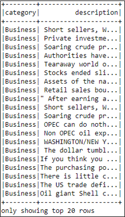
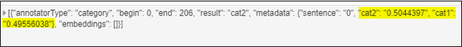
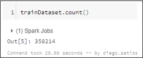
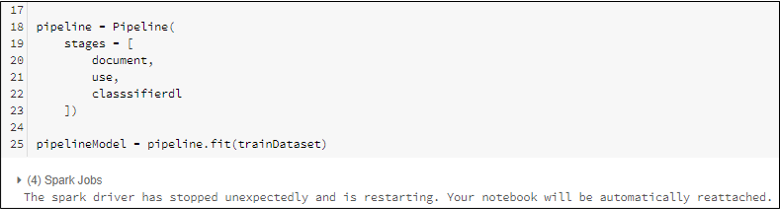
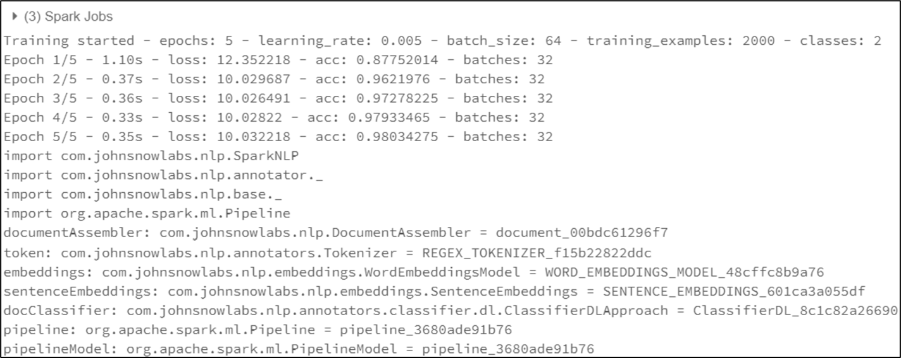
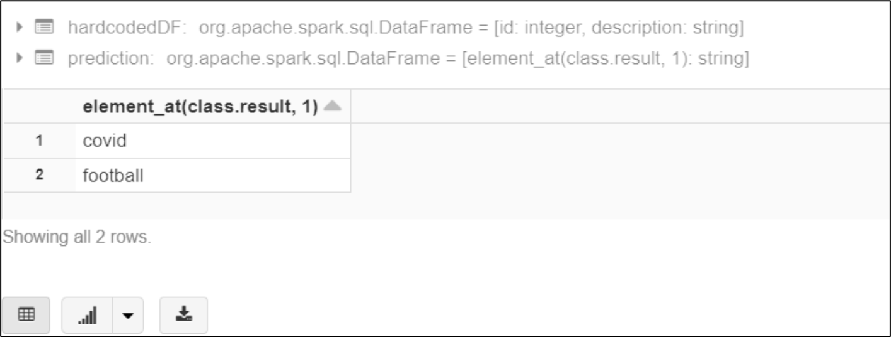
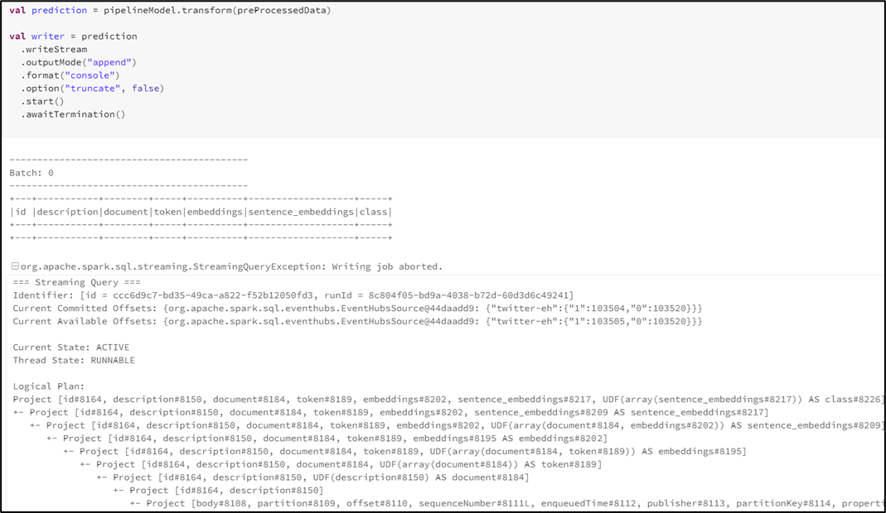
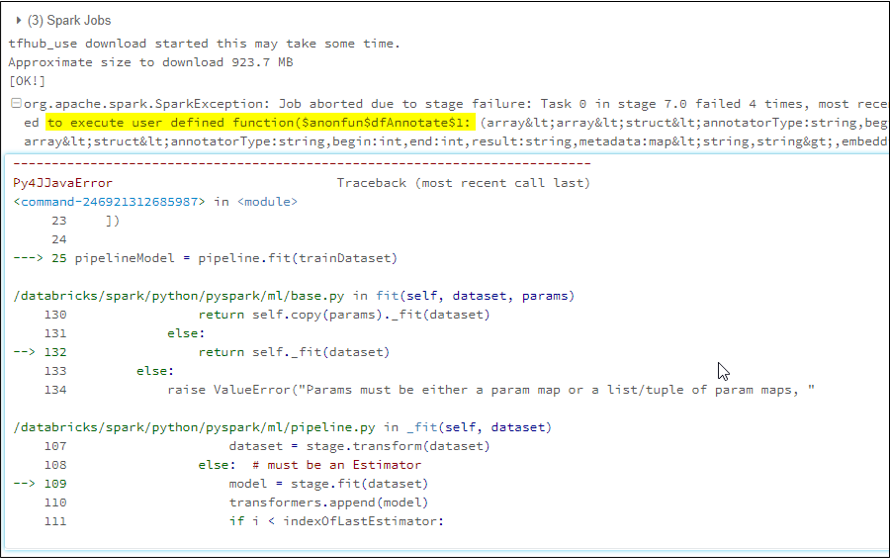
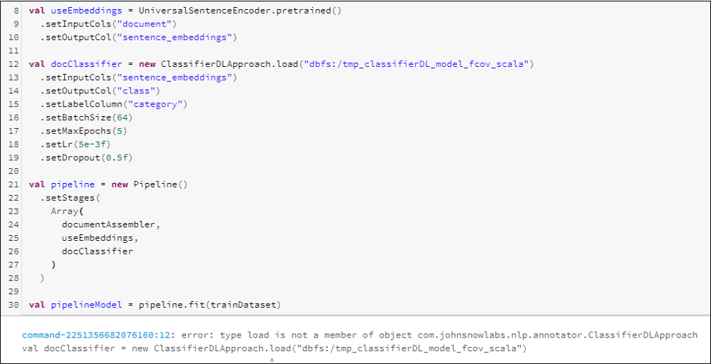

# Appendix A: Using Trained Models for text classification

In the Sporting Events application, we implemented the text classification for
tweets filtering with a manual algorithm, however, during the development we
tried several approaches, the most relevant was the use of a Trained Model based
on the [Spark NLP Library](https://nlp.johnsnowlabs.com/docs/en/quickstart) using the
[tutorial](https://github.com/JohnSnowLabs/spark-nlp-workshop/blob/master/jupyter/training/english/classification/ClassifierDL_Train_multi_class_news_category_classifier.ipynb)
provided by John Snow Labs. This tutorial is written in Python, however the library has also support for
Scala, which is the language we use in the rest of Databricks Notebooks. We are describing our experience in this appendix.

## The basics of the Trained Model

Using the Trained Model with the provided tutorial is simple, follow the next
steps:

1.  The main thing we need is a train Dataset, this must contain *a lot* of
    records with texts (sentences, paragraphs, or tweets in our case) with the
    predefined categories, the number of records should be large, in the
    tutorial 120.000 are used, but we also tried it with 2000.

    

    _First 20 rows of the Train Dataset for the tutorial, observe the name of the columns_

2.  This dataset must be placed in our Data Lake storage, then we must load the
    Dataset into a Data Frame with the following code:

    ```python
    trainDataset = spark.read \\

    .option("header", True) \\

    .csv("news_category_train.csv")
    ```

3.  With the Train Dataset loaded we can create a ML pipeline to train the
    model, observe that running this code will take about 10 minutes:

    ```python
    from pyspark.ml import Pipeline

    from sparknlp.annotator

    import \* from sparknlp.common

    import \* from sparknlp.base import \*

    \# actual content is inside description column

    document = DocumentAssembler()\\

    .setInputCol("description")\\

    .setOutputCol("document")

    use = UniversalSentenceEncoder.pretrained() \\

    .setInputCols(["document"])\\

    .setOutputCol("sentence_embeddings")

    \# the classes/labels/categories are in category column

    classsifierdl = ClassifierDLApproach()\\

    .setInputCols(["sentence_embeddings"])\\

    .setOutputCol("class")\\

    .setLabelColumn("category")\\

    .setMaxEpochs(5)\\

    .setEnableOutputLogs(True)

    pipeline = Pipeline(

    stages = [

    document,

    use,

    classsifierdl

    ])
    ```

4.  Now that we have the model trained, in theory we should be able to run text
    classification right away, however, as per December 2020, the NLP Library
    was having problems with the Trained Models not saved even with the latest
    versions, so we had to save it:

    ```python
    pipelineModel.stages[-1].write().overwrite().save('dbfs:/tmp_classifierDL_model')
    ```

5.  Then, we must create a new Pipeline loading the already trained model:

    ```python
    document2 = DocumentAssembler()\\

    .setInputCol("description")\\

    .setOutputCol("document")

    use2 = UniversalSentenceEncoder.pretrained() \\

    .setInputCols(["document"])\\

    .setOutputCol("sentence_embeddings")

    classsifierdl2 = ClassifierDLModel.load("dbfs:/tmp_classifierDL_model") \\

    .setInputCols(["sentence_embeddings"])\\

    .setOutputCol("class")

    pipeline2 = Pipeline(

    stages = [

    document2,

    use2,

    classsifierdl2

    ])
    ```

6.  Observe that we changed the name of the variables with a 2 respecting the
    tutorial and added the `dbfs` prefix to the path to save and load the model,
    now you can use the model to classify text like this:

    ```python
    prediction = pipeline.fit(trainDataset).transform(dfTest)
    ```

7.  `dfTest` must be the Dataset containing records to classify, you could either
    load it from a file or create one in memory like this:

    ```python
    from pyspark.sql.types import StringType

    dfTest = spark.createDataFrame([

    "Unions representing workers at Turner Newall say they are 'disappointed'
    after talks with stricken parent firm Federal Mogul.",

    "Scientists have discovered irregular lumps beneath the icy surface of
    Jupiter's largest moon, Ganymede. These irregular masses may be rock
    formations, supported by Ganymede's icy shell for billions of years..."

    ], StringType()).toDF("description")
    ```

8.  The name of the column must be `description`, also, observe from the code in
    the item 6 that calling `.fit(trainDataset)` is not training the model again,
    if we load the trained model it will execute the classification really fast.

9.  If the model is not saved and loaded you will get a log of errors in the
    predictions, taking a closer look we found that the percentages of
    probability used to assign to a category, or another were being assigned
    almost equally:

    

    _Error when model has not been saved_

The trained model as presented until here works well, indeed we did several tests.
The most relevant result showed that training the model with 2k register 
(equally divided in Football and Non-Football) it provided an accuracy of 99% 
for a static (non-streaming) test dataset of 600 registers, that is, the model classified the text of 594 registers accurately.

However, we have seen that even for the tutorial we had some trouble implementing it, now let us see the
problems we had migrating it to Scala and trying to analyze streaming data.

## The challenges of using the Trained Model in the application

The first thing to do to be able to use the Trained Model in the Sporting Event
application is to find/create a proper Dataset to train the model. That can be a bit
tedious as we must have a considerable number of tweets that we know in advance
that are really related to Football and the same number of ones not related to
Football. Fortunately, we found
[this](https://www.kaggle.com/rgupta09/world-cup-2018-tweets) Dataset that
contains tweets from the `FIFA 2018 World Cup`, all of them with Football-related
content. Also, we have [this](https://www.kaggle.com/gpreda/covid19-tweets)
Dataset with tweets containing the `#covid19` hashtag that was a hot topic during
the development of the application. Then, with these two categories we can
create a Dataset to train the model.

It is worth to mention that we had problems training the model with
exaggeratedly large data, we tried using 350.000 tweets and we had failures, so
we decided to go with 120.000 as the tutorial suggests and got good results. We
made an additional test with 2000 tweets in the two Football and Covid
categories and got acceptable results, too.



_A train dataset with 350k records_



_The error we were getting with a too large train dataset_

To give it a try with the two mentioned categories you can use [this](datasets/football-covid_2K.csv) dataset,
use the same code provided above just changing the path of the train dataset to
this new one that may have already been placed in the Data Lake, then train the
model save it and use [this](datasets/football-covid_600_en.csv) other dataset as the test to make predictions.

### Migrating to Scala

As our application is developed in Scala and the code provided for the Trained
Model is in Python, we had to migrate it. We are providing [here](code/ClassifierDL.scala) the complete code of
the Notebook in Scala so you can use it, otherwise we explain it step by step below:

1.  First, we need to import the necessary libraries and load the train & test Dataset with the following code:

    ```scala
    import com.johnsnowlabs.nlp.SparkNLP
    import com.johnsnowlabs.nlp.annotator._
    import com.johnsnowlabs.nlp.base._
    import org.apache.spark.ml.Pipeline

    val trainDataset = spark.read
      .option("header", true)
      .csv("mnt/input/football-covid_2K.csv")

    val testDataset = spark.read
      .option("header", true)
      .csv("mnt/input/football-covid_600_en.csv")
    ```

2.  With the Train Dataset loaded we can create a ML pipeline to train the
    model, notice that running this code will take about 10 minutes:

    ```scala
    SparkNLP.version

    val documentAssembler = new DocumentAssembler()
       .setInputCol("description")
       .setOutputCol("document")

    val token = new Tokenizer()
      .setInputCols("document")
      .setOutputCol("token")

    val embeddings = WordEmbeddingsModel.pretrained("glove_100d", lang = "en")
      .setInputCols("document", "token")
      .setOutputCol("embeddings")
      .setCaseSensitive(false)

    //convert word embeddings to sentence embeddings
    val sentenceEmbeddings = new SentenceEmbeddings()
      .setInputCols("document", "embeddings")
      .setOutputCol("sentence_embeddings")
      .setStorageRef("glove_100d")

    //ClassifierDL accepts SENTENCE_EMBEDDINGS 
    //UniversalSentenceEncoder or SentenceEmbeddings can produce SENTECE_EMBEDDINGS
    val docClassifier = new ClassifierDLApproach()
      .setInputCols("sentence_embeddings")
      .setOutputCol("class")
      .setLabelColumn("category")
      .setBatchSize(64)
      .setMaxEpochs(5)
      .setLr(5e-3f)
      .setDropout(0.5f)

    val pipeline = new Pipeline()
      .setStages(
        Array(
          documentAssembler,
          token,
          embeddings,
          sentenceEmbeddings,
          docClassifier
        )
      )

    // Let's train our multi-class classifier
    val pipelineModel = pipeline.fit(trainDataset)
    ```

    You should see an output like the following:

    

    _Successful Training Output_

3.  Now that we have the model trained, we can run text classification over a text in memory. Feel free to
    change the texts or add more, as desired.

    ```scala
    val hardcodedDF = spark.createDataFrame(Seq(
      (1, "#Coronavirus update (13th Aug)lIndia's #COVID19 tally rises to 23,96,638 including 6,53,622 active cases, 16,95,98Ÿ?? https://t.co/92DbEYyo7w"),
      (2, "@Football__Tweet: Football is cruel. #WorldCup #DEN https://t.co/rYBBsrm0JE")
    )).toDF("id", "description")

    val prediction = pipelineModel.transform(hardcodedDF).select(element_at($"class.result", 1))
 
    display(prediction)
    ```

    As a result, you will find this output:

    

    _Scala Classifier Output_
 
4.  Until this step, the classifier works well, as shown above. However, when we tried to adapt the solution
    to the streaming mode, we encountered problems that prevented us from doing so. The idea was to integrate
    the classifier into a Databricks that was reading data from an event hub and then send it back to another
    event hub or at least show the classified data in the console. Here is a snippet of the main part of
    the code:

    ```scala
    
    import org.apache.spark.eventhubs._
    import com.microsoft.azure.eventhubs._
    import org.apache.spark.sql.types._
    import org.apache.spark.sql.functions._
    import com.johnsnowlabs.nlp.pretrained.PretrainedPipeline
    import java.util.zip.GZIPInputStream
    import java.io.ByteArrayInputStream
    import org.apache.spark.sql.functions._

    // Add here the corresponding configuration for the incoming Event Hub
    val connectionString = org.apache.spark.eventhubs.ConnectionStringBuilder("CONNECTION-STRING")
      .setEventHubName("EVENT-HUB-NAME")
      .build

    val eventHubsConf = EventHubsConf(connectionString)
      .setStartingPosition(org.apache.spark.eventhubs.EventPosition.fromEndOfStream)
      .setMaxEventsPerTrigger(100)   

    var incomingStream = 
      spark.readStream
        .format("eventhubs")
        .options(eventHubsConf.toMap)
        .option("rowsPerSecond",10)
        .load()

    val decompress = udf{compressed: Array[Byte] => {
      val inputStream = new GZIPInputStream(new ByteArrayInputStream(compressed))
      scala.io.Source.fromInputStream(inputStream).mkString
    }}

    val tweetSchema = new StructType()
      .add("event_id", StringType)
      .add("full_text", StringType)
      .add("retweet_count", StringType)
      .add("favorite_count", StringType)

    val preProcessedData = incomingStream
      .withColumn("data", from_json(decompress($"body"), tweetSchema))
      .withColumn("idEvent", $"data.event_id")
      .withColumn("description", $"data.full_text")
      .withColumn("id",$"data.event_id")
      .select("id", "description")

    val prediction = pipelineModel.transform(preProcessedData)

    val writer = prediction
      .writeStream
      .outputMode("append")
      .format("console")
      .option("truncate", false)
      .start()
      .awaitTermination()
    ```

    However, we struggled with this problem obtaining this result and decided to use the basic classifier
    instead:

    

    _Scala Classifier Streaming Output Error_


### Errors training the model

Here we show a list of some common problems we faced.

You might find your self several times getting an error like this:



_User Defined Function Error_

This was one of the most common errors we had, by researching it we could not
find a satisfactory solution, this error is thrown sometimes when training the
model and sometimes showing the predicted categories after all previous
processes had succeeded.

### Saving the model in Scala

As we were moving to Scala, we tried using the same approach we took with
Python, say: train the model, save it and load again to make the predictions as
we knew that without saving the predictions were not working, then, we encountered
issues saving the model:



_No Load Method Error_

Even when the documentation specified that the object has in fact a load
method.

### Upgrading the library version

We found that the problem of having to save the Trained Model to be able to make
predictions was known (see
[this](https://github.com/JohnSnowLabs/spark-nlp/pull/1232) PR), and a recent
fix had been implemented, so we upgraded the library version to 2.6.5.


