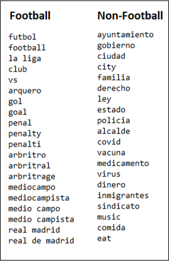
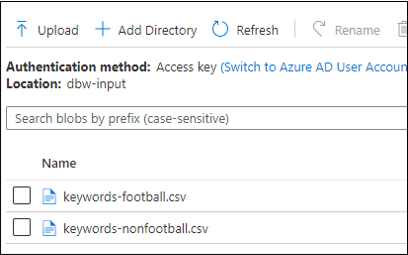
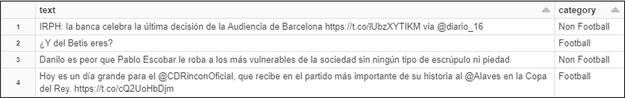

# Module 06 -Text Classification

# Index 📚

- [Text Classification](#text-classification)
- [Manual Tweets Classification](#manual-tweets-classification)
- [Implementing the algorithm](#implementing-the-algorithm)
- [Accuracy of the algorithm](#accuracy-of-the-algorithm)
- [Summing up](#summing-up)
- [Next Steps](#next-steps)

The implementation we have gotten so far puts a stream of tweets data into an
Event Hub, now we need to perform some transformations and analysis over that
data:

-   **Text Classification** to filter tweets not related to Football that may have
    made its way to this stage and are undesired in the next stages.

-   **Language Detection** that we employ to analyze sentiment only over tweets in
    English due to limitations of the library we use.

-   **Sentiment Analysis** to detect if the tweet has a Positive, Neutral or
    Negative content.

To perform those tasks, we use a Databricks Notebook reading the stream and
performing the operations live. In this module we will cover the implementation
of text classification and in the two subsequent modules we will see how to
implement the other two operations.

## Text Classification

In simple words, text classification consists in assigning a category from a
predefined set to a particular short text. For example, you may have the
following categories:

-   Science

-   Economic

-   Politics

-   Sports

Then, having a bunch of sentences or paragraphs, the idea would be to have an
automated way to assign to every text the corresponding category. This is not an
easy task and usually may require the use of:

-   Machine Learning

-   Artificial Intelligence

-   Neural Networks

-   Deep Learning

-   Trained Models

For our purposes we explored two different approaches. The simplest one is a
manual approach that came to be effective and is the one that we finally
implemented. We also tried a Trained Model built on top of the [Spark NLP
Library](https://nlp.johnsnowlabs.com/docs/en/quickstart), 
this trained model proved to be effective to classify static datasets
but presented many issues analyzing streams, so we did not use it in the
application. In this [appendix](./appendices/A-trained-model.md)
 you can find details of how to work with the
trained model and the issues that we had.

## Manual Tweets Classification

The way we finally implemented our text classification to filter tweets not
related to the Sporting Events is simple, we used a calculated score for the
text of a given tweet based on the occurrence of words from two sets: one set of
football-related words and another one with words not related to football. 
In the image below you can see a small subset of the words we used in each dictionary.



_Sample of the words contained in the dictionaries_

Observe that for the non-football words we picked those carefully because one
may tend to think that any word not in the small universe of football-related
words may serve but that is not true. If we would include all other words not in
the left set, we would end up having all words categorized as non-football
because there are just too many chances for any of those to appear in any given
text.

## Implementing the algorithm

As mentioned, for this part we use Databricks, let us see the steps you need to
implement the tweets classification:

1.  First, we must create the Dictionaries or datasets with football-related and
    non-football-related words. You can find the files we used [here](datasets/keywords-football.csv) and [here](datasets/keywords-nonfootball.csv), or
    you can create your own if you want to. Copy those files in the location of the
    Data Lake of your preference.

    

    _Dictionaries files in the Data Lake storage_

2.  Create a new Notebook and add a new cell, put the following code to read the files:

    ```python
    val footballDf = spark.read
                .option("header", true)
                .csv("/mnt/input/keywords-football.csv")
    val nonFootballDf = spark.read
                .option("header", true)
                .csv("/mnt/input/keywords-nonfootball.csv")

    val fDict = footballDf.select($"f").filter($"f".isNotNull).collect.map(_.toSeq).flatten.map(_.asInstanceOf[String])
    val nfDict = nonFootballDf.select($"nf").filter($"nf".isNotNull).collect.map(_.toSeq).flatten.map(_.asInstanceOf[String])
    ```

3.  Add another cell and paste the following code:

    ```python
    implicit def bool2int(b:Boolean) = if (b) 1 else 0
    // User Defined Function for processing content of messages to return their category.
    val whichCategory =
        udf((tw: String) =>
            {
                var cat = 0

                var twLower = tw.toLowerCase()
                val twResult = twLower.replace('á', 'a').replace('é', 'e').replace('í', 'i').replace('ó', 'o').replace('ú', 'u')

                for (el <- fDict) {
                  cat = cat + twResult.contains(el)
                }
                for (el <- nfDict) {
                  cat = cat - twResult.contains(el)
                }

                if (cat > 0) {
                  "Football"
                }
                else {
                  "Non Football"
                }
            }
        )
    ```

4.  The precedent code makes some transformations over the text passed as
    parameter eliminating accented letters and turning it all to lowercase, then
    iterates the two of the dictionaries to find the occurrences of the
    different set of words to calculate the score and returns the corresponding category.

5.  You could use the following code to debug/test/tinker with the algorithm:

    ```python
    val testDF = Seq(
      ("IRPH: la banca celebra la última decisión de la Audiencia de Barcelona https://t.co/lUbzXYTIKM via @diario_16"),
      ("¿Y del Betis eres?"),
      ("Danilo es peor que Pablo Escobar le roba a los más vulnerables de la sociedad sin ningún tipo de escrúpulo ni piedad"),
      ("Hoy es un día grande para el @CDRinconOficial, que recibe en el partido más importante de su historia al @Alaves en la Copa del Rey. https://t.co/cQ2UoHbDjm")
    ).toDF("text")

    val result = testDF.withColumn("category", whichCategory($"text"))

    display(result)
    ```

6.  Running the previous code, you will get this result:

    

    _Testing the classification algorithm_

## Accuracy of the algorithm

We performed an accuracy test by running the classification and retrieved a
statistical sample of 500 classified records, then, manually we went over those
and determined which is the real classification (a tedious job yeah, we know but
we did it), then we were able to compare the results of the algorithm with the
real data, those are presented in the following table:

|        Total              |     |     |                 |
|:-------------------------:|:---:|:---:|:---------------:|
|       *Non Football*      | 355 | 70% |                 |
|         *Football*        | 155 | 30% |                 |
|            SUM            | 510 |     |                 |
|                           |     |     |                 |
|    **General Accuracy**   |     |     |                 |
|            TRUE           | 429 | 84% |                 |
|           FALSE           |  81 | 16% |                 |
|            SUM            | 510 |     |                 |
|                           |     |     |                 |
| **Accuracy for Football** |     |     |                 |
|            TRUE           | 108 | 70% |*True Positives* |
|           FALSE           |  47 | 40% |*False Negatives*|
|            SUM            | 155 |     |                 |
|                           |     |     |                 |
|**Accuracy for Non-Football**|   |     |                 |
|            TRUE           | 321 | 90% | *True Negatives*|
|           FALSE           |  34 | 10% |*False Positives*|
|            SUM            | 355 |     |                 |

_Evaluation of the accuracy of the algorithm_

We can see that in general, 84% of the tweets were classified accurately (known as the classifier **accuracy**),
meanwhile, of those that were classified as Football (*true positives*, the ones relevant for our
application) 70% were accurate (known as the classifier **recall**), which is a fairly good percentage. Finally, 
the ratio between the true positive results and the universe of positives was 76% (known as the classifier **precision**). 

Regarding the misclassified elements, 30% were *false negatives* (tweets about football, 
but the system recognized them as non-football),
and just 10% were *false positives* (tweets that the algorithm considered as football, although they were
about another topic). Minimizing false positives rather than false negatives was one of our goals, as 
this would make a cleaner output with a small number of tweets about non-football aspects.

# Summing up

In this module we have implemented a text classification algorithm to filter tweets with content not related to Footbal as the Dashboard must show information related to the Football events only. Next we will be implementing some additional analysis in the same Databricks Notebeook.

# Next Steps

Go to [Module 07 - Language Detection](../07-language-detection/readme.md)