# Module 7 – Language Detection

# Index 📚

- [Azure Cognitive Services](#azure-cognitive-services)
- [Creating a Cognitive Services instance](#creating-a-cognitive-services-instance)
- [Exploring Cognitive Services with Postman](#exploring-cognitive-services-with-postman)
- [Calling the Cognitive Services API from Databricks](#calling-the-cognitive-services-api-from-databricks)
- [Summing Up](#summing-up)
- [Next Steps 🚶](#next-steps-)


In the next module we will see that we perform _Sentiment Analysis_ over the
tweets in the stream. However, to make this analysis we first need to detect
the language of the tweet for two main reasons:

-   The _Sentiment Analysis_ algorithms, in general, require the language to be specified

-   The _NLP Library_ we use, only detects sentiments for text in English

To detect the language, we use [Azure Cognitive Services](https://docs.microsoft.com/en-us/azure/cognitive-services/what-are-cognitive-services). Even though the _Spark NLP library_ offers language detection capabilities, it did not show good performace with tweets' text. 

Let us see how we implemented the _Language Detection_.

## Azure Cognitive Services

[Cognitive Services](https://docs.microsoft.com/en-us/azure/cognitive-services/what-are-cognitive-services) offers a wide variety of options to work with _Artificial Intelligence_, mostly using API calls. Particularly, it offers a _Text Analytics_ feature that allows to detect language, sentiments, keywords and entities, given a certain text. We used the _Language Detection_ feature for the implementation.

## Creating a Cognitive Services instance

To be able to perform operations with _Cognitive Services_ we first need to create
an instance, proceed as follows for this:

1.  Go to the _Azure Portal_, in the upper search bar write *Cognitive*, and
    select the *Cognitive Services* option from the list:

    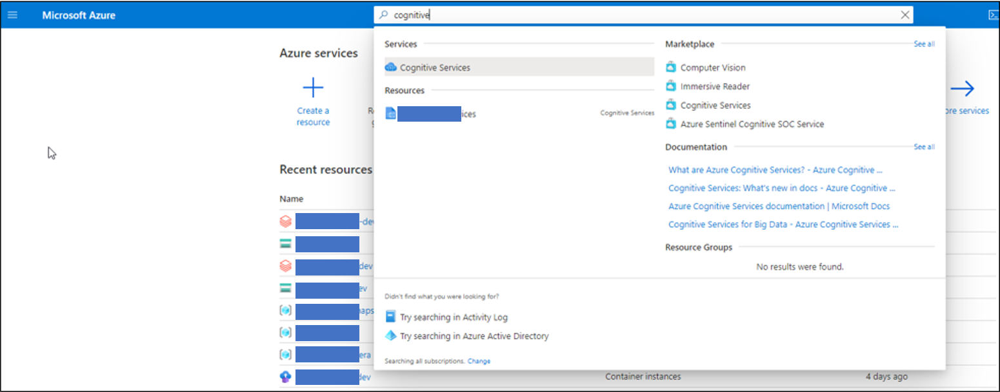

    _Searching for Cognitive Services in the Azure Portal_

2.  In the _Cognitive Services_ page select *+ Add*:

    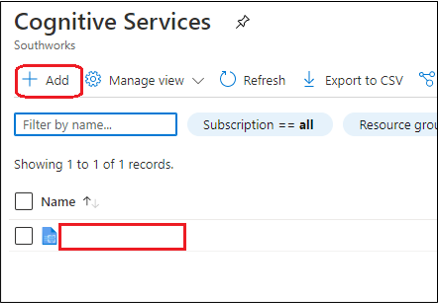

    _Addition of a new Cognitive Services instance_

3.  You will see the _Marketplace_ view, there are lots of options for _Cognitive
    Services_ that you can create. Write _Text Analytics_ in the search input and click
    on the *Text Analytics* card.

    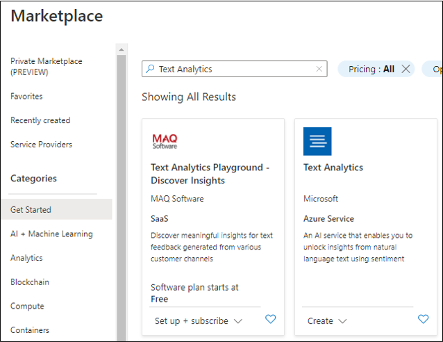

    _Searching Text Analytics for Cognitive Services in the Azure Portal_

4.  You will see a view like the following, proceed to click the *Create* button:

    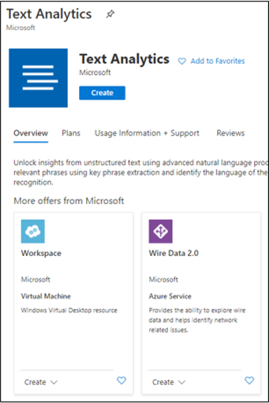

    _Creating a Text Analytics Cognitive Service_

5.  Fill in the creation form, click *Create* and wait until the resource is
    deployed:

    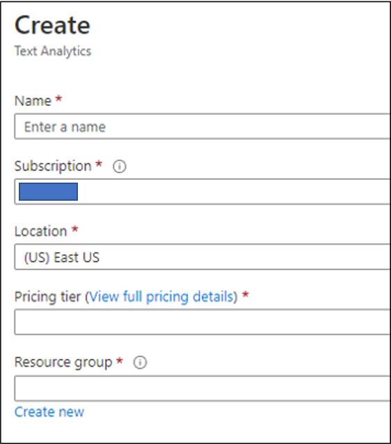

    _Text Analytics creation form_

6.  Once the deployment has finished, click the *Go to resource* button:

    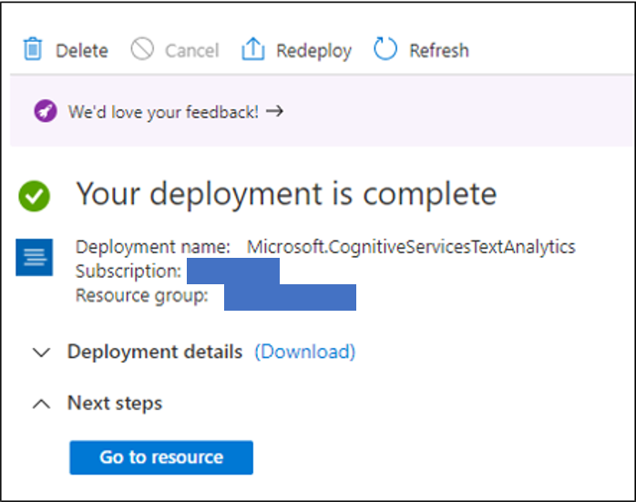

    _Text Analytics resource deployed_

7.  You will see the resource page, click the overview item in the left panel,
    observe that you have the resource with the name you entered in the creation
    form, and that the URL for your endpoint contains a name that must be
    unique across Azure:

    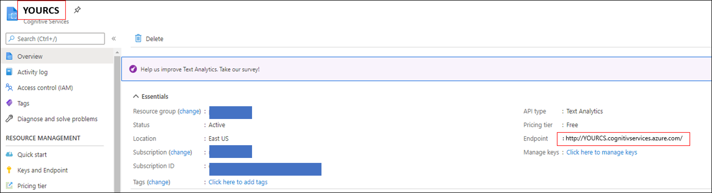

    _View of the Cognitive Services resource_

8.  Take note of your resource URL, also, click the _Manage Keys_ link just below
    the URL. You will see a screen that allows you to see the secret keys you
    can use to make API calls to your service:

    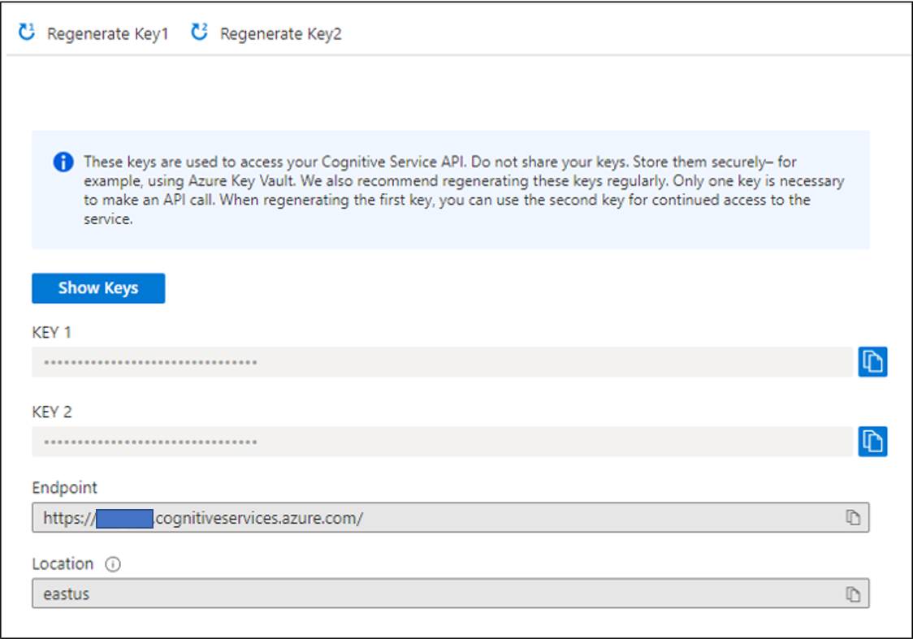

    _View of keys management for Cognitive Services_

## Exploring Cognitive Services with Postman

Let us take a first look at how _Cognitive Services_ can be used to recognize the
language of text. We will use *Postman* to make an API call:

1.  Create a new _Postman_ request, set an Authorization header as Bearer Token
    and fill it with the secret key from your _Cognitive Services_ resource, also
    set the URL and body as:

    1.  <https://ggcognitiveservices.cognitiveservices.azure.com/text/analytics/v3.0/languages>

    2. code:
    ```python
      {

        "documents": [

            {

                "id": "1",

                "text": "Janeiro foi o primeiro mês de André na faculdade. O rapaz
                decidiu estudar para ser advogado e está muito animado com isso"

            },

            {

                "id": "2",

                "text": "esta es una sentencia de prueba en español"

            },

            {

                "id": "3",

                "text": "Let us see if Cognitive Services can tell the language of this
                text"

            }

        ]

    }
    ```
2.  Your request should look like this

    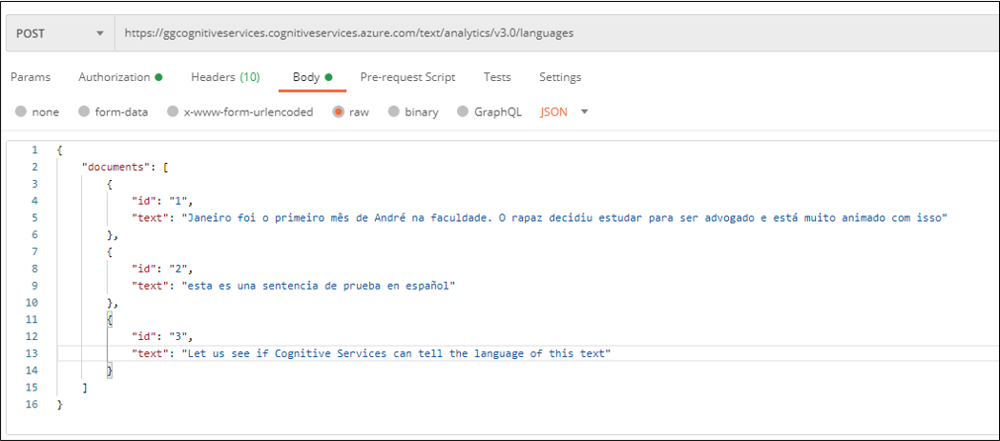

    _View of a Postman request to Cognitive Services for Language Recognition_

3.  Then send the request and you should get a result like this:

    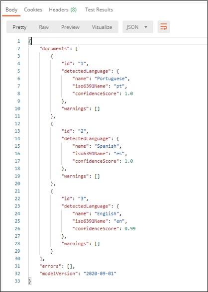

    _View of the response from Cognitive Services for Language Recognition_

## Calling the Cognitive Services API from Databricks

We used
[this](https://docs.microsoft.com/en-us/azure/databricks/scenarios/databricks-sentiment-analysis-cognitive-services)
tutorial from _Microsoft_ to integrate the _Cognitive Services_ to _Databricks_ so that we
can use this for the stream analysis, it’s simple once you have the code
working:

1.  Include a new cell in the Notebook you will be using for the _Text
    Classification, Language Detection and Sentiment Analysis_. We show in the
    following image just a part of the code as it is quite large to be included,
    but you can find the complete code [here](../08-sentiment-analysis/code/SentimentAnalysisAndClassificationIntegration.scala):

    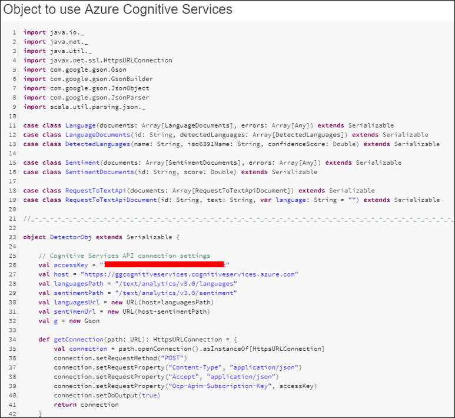

    _Object to call Cognitive Services API_

2.  Observe that the code provided for invoking _Cognitive Services_ has been
    modified with respect to the tutorial to replace the usage of java classes by
    a manual manipulation of the _JSON_ returned. This is because we were facing
    problems with the original way.

3.  Include the following code in a new cell:

    ```python
    // User Defined Function for processing content of messages to return their
    sentiment.

    val whichLanguage =

    udf((textContent: String) =\>

        {

            val inputObject = new RequestToTextApi(Array(new
            RequestToTextApiDocument(textContent, textContent)))

            val detectedLanguage = DetectorObj.getLanguage(inputObject)

            if (detectedLanguage == "none") {

                "none"

            } else {

                detectedLanguage

            }

    })
    ```

4.  The precedent code defines a *User Defined Function (udf)* that makes use of
    the *DetectorObj* defined previously to make specific API calls. This must
    be defined as *udf* because if we place the code in a cell with other code,
    we would be getting a *non-serializable class* error.

# Summing Up

Until now, we have set the elements required to perform _Text Classification_ and now _Language Detection_. We will be incorporating those in the stream analysis along with _Sentiment Analysis_ in the next module.

# Next Steps 🚶

Go to [Module 8 - Sentiment Analysis](../08-sentiment-analysis/readme.md)
