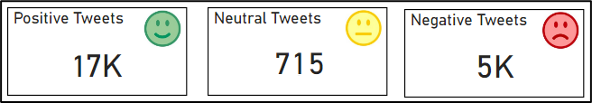
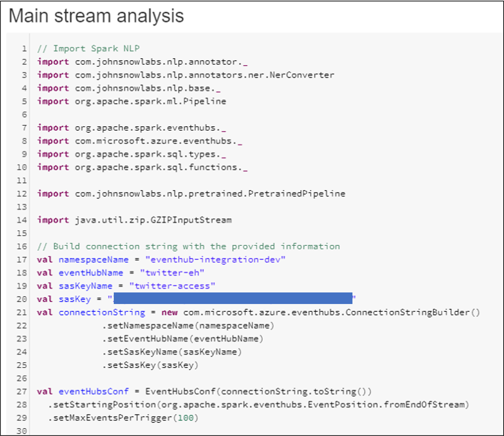
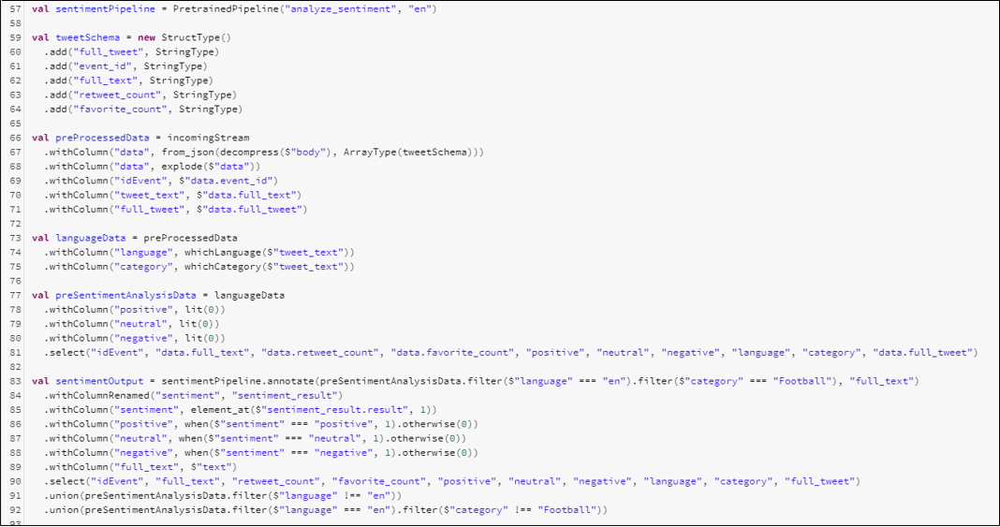

# Module 8 - Sentiment Analysis

# Index 📚

- [Performing Sentiment Analysis in Databricks](#performing-sentiment-analysis-in-databricks)
- [Summing Up](#summing-up)
- [Next Steps 🚶](#next-steps-)

_Sentiment Analysis_ is a technique used to determine whether the content of a text is
positive, neutral or negative. It is not in our scope to dive into the details of
how this analysis is carried out over a given text, in fact, today many
resources exist that allow to perform sentiment analysis using
libraries or API calls.

In the _Sporting Events Application_, we use _Sentiment Analysis_ to add to the
_Dashboard_ three additional fields showing for each match the count of tweets
with _positive/neutral/negative_ content.

_Sentiments displayed in the Dashboard_

## Performing Sentiment Analysis in Databricks

To perform _Sentiment Analysis_ in _Databricks_ we use the [NLP Library](https://nlp.johnsnowlabs.com/docs/en/quickstart) with a
pretrained model provided by John Snow Labs. To see how we do it let us go over
several sections of the code. Remember that we managed to implement _Text
Classification, Language Detection_ and now we will implement this additional
analysis, but it will be done in the main block that reads the stream and performs
all the analysis.

1.  First step is to include the libraries we need for the analysis:

    

    _Libraries included for sentiment analysis_

2.  We then need to create the pipeline (line 57) and with that we perform the
    analysis of only the tweets that are in _English_ and have been categorized as
    _Football_ (line 83):

    

    _View of the main code block where sentiment analysis is performed_

1.  In a stream analysis the calls to functions usually take a Data Frame, the
    function internally transforms the input Data Frame by adding result
    columns, that is why you see in line 84 and 85 that we rename the column and
    extract the result for comparison.

2.  This is our approach. For each line of data (tweets) we create three columns:
    for positive, neutral, and negative sentiments each, then according to the
    results of the sentiment analysis for a given tweet, we place a value of 1 in
    the corresponding column being those mutually exclusive (a tweet may contain
    a single sentiment at a time).

You can check [the code](./code/SentimentAnalysisAndClassificationIntegration.scala) and find the other parts that perform the connection to
the Event Hub to read the stream, the call to the _Text Classification_ and
_Language Detection_ functions and then several transformations prior to sending the
processed stream to the next Event Hub to be read by the Stream Analytics.

# Summing Up

In this module we implemented Sentiment Analysis and put together the three analysis operations of Text Classification, Language Detection & Sentiment Analysis over the stream. The stream is transformed and sent to another instance of Event Hub to be processed by the Stream Analytics which is what we will see in the next module.

# Next Steps 🚶

Go to [Module 9 - Stream Analytics](../09-stream-analytics/readme.md)
