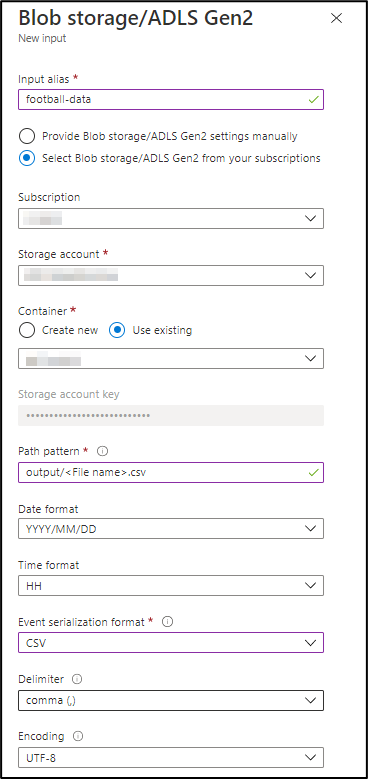

# Module 9 - Stream Analytics

# Index 📚

- [Stream Analytics Data Transformation](#stream-analytics-data-transformation)
  - [Defining the Inputs](#defining-the-inputs)
    - [Adding the Static Data Input](#adding-the-static-data-input)
    - [Adding the Processed Stream Data Input](#adding-the-processed-stream-data-input)
    - [Adding the Raw Stream Data Input](#adding-the-raw-stream-data-input)
  - [Defining the Events Output](#defining-the-events-output)
  - [Defining the Highlighted Users Output](#defining-the-highlighted-users-output)
  - [Performing the Transformation](#performing-the-transformation)
- [Summing Up](#summing-up)
- [Next Steps](#next-steps)

# Stream Analytics Data Transformation

## Defining the Inputs

For this process, we will use three inputs with different characteristics: 
- The first one is **semi-static data** input 
containing the events' information gathered by Data Factory from the API, this data changes once per day and 
is read from the Data Lake. 
- The second entry contains the **processed tweets data** coming from Databricks and
 is a stream, since the data is constantly arriving through an Event Hub. 
- The third input is also a stream but contains the 
**raw tweets** coming directly from the first Event Hub.

By joining these inputs we will be able to generate the outputs for:
- A **detailed view** of the events and teams data.
- A **highlighted-users view** with the most popular tweets about the topic and the corresponding Twitter accounts.

### Adding the Static Data Input

When adding data that is static this must be done by reference within the Stream Analytics inputs. In this case, a Data Lake storage will be used. You must do it in the following way:

1. From the Azure Portal, open the **All resources** page, and find the Stream Analytics job that will be used.
2. In the **Job Topology** section of the Stream Analytics job, select **Inputs**.
3. Select **+ Add reference input** and **Blob storage/ADLS Gen2**. Fill in the input form with the following values:

    | Setting | Suggested value | Description |
    | ------- | --------------- |------------ |
    | Input alias | football-data | Provide a friendly name to identify your input (like `football-data`). Input alias can contain alphanumeric characters, hyphens, and underscores only and must be 3-63 characters long. |
    | Subscription | \<Your subscription> | Select the Azure subscription where you created the resource. |
    | Storage Account | \<Your storage account> | The name of the storage account where your blobs are located. If it’s in the same subscription as your Stream Analytics Job, you can select it from the drop-down. |
    | Storage Container | \<Your Data Lake container> | Containers provide a logical grouping for blobs stored in the Microsoft Azure Blob service. When you upload a blob to the Blob service, you must specify a container for that blob. |
    | Path Pattern | output/\<File name>.csv | This is a required property that is used to locate your blobs within the specified container. If the blob doesn't exist in the specified path, the Stream Analytics job will wait indefinitely for the blob to become available. |
    | Event Serialization Format | CSV | To make sure your queries work the way you expect, Stream Analytics needs to know which serialization format you're using for incoming data streams. For Reference Data, the supported formats are CSV and JSON. |

4. Use the default options on the remaining settings and select **Save**.

    

    _Creating the static events input_

### Adding the Processed Stream Data Input

To add the data that comes from a stream, the process is very similar to what is done to add an entry by
 reference, the idea is to add an Event Hub stream input from where the data is being placed.

1. From the Azure Portal, open the **All resources** page, and find the Stream Analytics job that will be used.
2. In the **Job Topology** section of the Stream Analytics job, select **Inputs**.
3. Select **+ Add stream input** and **Event Hub**. Fill in the input form with the following values:

    | Setting | Suggested value | Description |
    | ------- | --------------- |------------ |
    | Input alias | processed-tw | Provide a friendly name to identify your input (like `processed-tw`). Input alias can contain alphanumeric characters, hyphens, and underscores only and must be 3-63 characters long. |
    | Subscription | \<Your subscription> | Select the Azure subscription where you created the event hub. The event hub can be in the same or in a different subscription as the Stream Analytics job. |
    | Event Hub namespace | \<Your Event Hub namespace> | The name of the Event Hub container where your Event Hub is located.
    | Event Hub name |  \<Your Event Hub name> | The name of the Event Hub where your events are located. If already created, you can select 'Use existing'. |
    | Event Hub consumer group | \<Your Event Hub consumer group> | Provide a consumer group for exclusive usage by this Stream Analytics Job . |
    | Event Hub namespace | \<Your Event Hub namespace> | The name of the Event Hub container where your Event Hub is located. |
    | Authentication mode | Connection string | Select 'Connection string'. |
    | Event Hub policy name | \<Your Event Hub policy name> | The policy allows the ASA job to read from this Event Hub. For security reasons, we recommend creating a dedicated policy for each job. |
    | Partition key | Leave empty | If your input is partitioned by a property, you can add the name of this property here. We are not doing that, so leave it empty. |
    | Event serialization format | JSON | Stream Analytics needs to know which serialization format you're using for incoming data streams. |
    | Encoding | UTF-8 | UTF-8 is the only supported encoding format as per December 2020. |
    | Event compression type | None | The compression option enables you to specify a compression type of GZip, Deflate, or no compression. In this processed stream we are using no compression. |

4. Next, select **Save**.

    

    _Creating the processed stream input_

### Adding the Raw Stream Data Input

Now, we are going to add the other Event Hub stream input with the raw data ingested from the Twitter API. 

1. Repeat steps 1 to 3 from the previous section with this new settings. Remember to use the corresponding Event Hub configuration, i.e. not the same Event Hub as above:

    | Setting | Suggested value | Description |
    | ------- | --------------- |------------ |
    | Input alias | event-tw | Provide a friendly name to identify your input (like `event-tw`). Input alias can contain alphanumeric characters, hyphens, and underscores only and must be 3-63 characters long. |
    | Subscription | \<Your subscription> | Select the Azure subscription where you created the event hub. The event hub can be in same or a different subscription as the Stream Analytics job. |
    | Event Hub namespace | \<Your Event Hub namespace> | The name of the Event Hub container where your Event Hub is located.
    | Event Hub name |  \<Your Event Hub name> | The name of the Event Hub where your events are located. If already created, you can select 'Use existing'. |
    | Event Hub consumer group | \<Your Event Hub consumer group> | Provide a consumer group for exclusive usage by this Stream Analytics Job . |
    | Event Hub namespace | \<Your Event Hub namespace> | The name of the Event Hub container where your Event Hub is located. |
    | Authentication mode | Connection string | Select 'Connection string'. |
    | Event Hub policy name | \<Your Event Hub policy name> | The policy allows the ASA job to read from this Event Hub. For security reasons, we recommend creating a dedicated policy for each job. |
    | Partition key | Leave empty | If your input is partitioned by a property, you can add the name of this property here. We are not doing that, so leave it empty. |
    | Event serialization format | JSON | Stream Analytics needs to know which serialization format you're using for incoming data streams. |
    | Encoding | UTF-8 | UTF-8 is the only supported encoding format as per December 2020. |
    | Event compression type | GZip | In this raw stream coming from the C# App we are using GZip compression. |

2. Next, select **Save**.

    

    _Creating the raw stream input_ 


## Defining the Events Output

The output of the transformation will be sent to Power BI to be used to display the statistics and calculated values. These values will be written into a dataset that will then be available for use in Power BI. To define the output, it should be done as follows:

1. From the Azure Portal, open **All resources**, and find the Stream Analytics job that will be used.
2. In the **Job Topology** section of the Stream Analytics job, select the **Outputs** option.
3. Select **+ Add** > **Power BI**. Then, select **Authorize** and follow the prompts to authenticate with Power BI.

    

    _Creating the Power BI events output_

4. Fill in the output form with the following details and select Save:

    | Setting             | Suggested value       |
    | ------------------- | --------------------- |
    | Output alias        | events-dataset        |
    | Group workspace     | \<Your Workspace>     |
    | Dataset name        | eventsds              |
    | Table name          | events                |
    | Authentication mode | User token            |

## Defining the Highlighted Users Output

1. Repeat the steps 1 to 4 from the previous section, but with this configuration:

    | Setting             | Suggested value       |
    | ------------------- | --------------------- |
    | Output alias        | influencers-dataset   |
    | Group workspace     | \<Your Workspace>     |
    | Dataset name        | influencersds         |
    | Table name          | influencers           |
    | Authentication mode | User token            |

## Performing the Transformation

1. All data comes in a way defined in the contract with each previous component. In the case of raw data from the C# app, the input format will contain the following columns:

    ```raw
    | event_id | full_text | retweet_count | favorite_count |
    |----------|-----------|---------------|----------------|
    |          |           |               |                |
    ```

2. The processed stream contains the following information:

    ```raw
    | event_id | full_text | retweet_count | favorite_count | positive | neutral | negative | language | category | full_tweet |
    |----------|-----------|---------------|----------------|----------|---------|----------|----------|----------|------------|
    |          |           |               |                |          |         |          |          |          |            |
    ```

3. Regarding the static **CSV** files, the following format is expected:

    ```raw
    | idEvent | strEvent dateEvent | strStadium | strThumb | strReferee | idHomeTeam | homeTeamName | homeTeamBadge | idAwayTeam | awayTeamName | awayTeamBadge | keywords |
    |---------|--------------------|------------|----------|------------|------------|--------------|---------------|------------|--------------|---------------|----------|
    |         |                    |            |          |            |            |              |               |            |              |               |          |
    ```

4. To transform your data, you must first ensure that the values are correct. In the case of the values that come preprocessed from streaming over Twitter, these should be normalized to avoid errors related to the expected data types. For that, a cast must be performed to ensure that the same type of data is obtained as required.
    Also, we filter by the category of the event to only allow the football-related tweets to reach the output:

    ```sql
    SELECT 
        tsi.idEvent as event_id,
        tsi.full_text,
        TRY_CAST(tsi.retweet_count AS bigint) AS retweet_count,
        TRY_CAST(tsi.favorite_count AS bigint) AS favorite_count,
        tsi.positive as positive,
        tsi.neutral as neutral,
        tsi.negative as negative
    FROM [processed-tw] tsi
    WHERE tsi.category = 'Football'
    ```

5. The result of this query will have the tweets' data joined with the events' data, we need also to obtain those related to the teams. For this, a match must be made with respect to the team name (using a Regex) and in case of a successful match, these statistics need to be added for the teams, as well. To achieve this, the join must be done with the events. This is performed in the following way:

    ```sql
    SELECT 
        System.Timestamp AS WindowEnd,
        SUM(tppi.positive) as match_positive_count,
        SUM(tppi.neutral) as match_neutral_count,
        SUM(tppi.negative) as match_negative_count,
        eppi.idEvent as match_id,
        COUNT(eppi.idEvent) as match_mentions,
        SUM(tppi.retweet_count) as match_rts,
        SUM(tppi.favorite_count) as match_favorites,
        SUM(SIGN(REGEXMATCH (tppi.full_text, '(' + REPLACE(eppi.homeTeamName, ' ', '|') + ')'))) as home_mentions,
        SUM(SIGN(REGEXMATCH (tppi.full_text, '(' + REPLACE(eppi.homeTeamName, ' ', '|') + ')')) * tppi.favorite_count) as home_favorites,
        SUM(SIGN(REGEXMATCH (tppi.full_text, '(' + REPLACE(eppi.homeTeamName, ' ', '|') + ')')) * tppi.retweet_count) as home_rts,
        SUM(SIGN(REGEXMATCH (tppi.full_text, '(' + REPLACE(eppi.awayTeamName, ' ', '|') + ')'))) as away_mentions,
        SUM(SIGN(REGEXMATCH (tppi.full_text, '(' + REPLACE(eppi.awayTeamName, ' ', '|') + ')')) * tppi.favorite_count) as away_favorites,
        SUM(SIGN(REGEXMATCH (tppi.full_text, '(' + REPLACE(eppi.awayTeamName, ' ', '|') + ')')) * tppi.retweet_count) as away_rts
    FROM TwitterPreProcessedInfo tppi
    JOIN [football-data] eppi ON tppi.event_id = eppi.idEvent
    GROUP BY eppi.idEvent, tppi.positive, tppi.neutral, tppi.negative, TumblingWindow(minute, 5)
    ```

6. To end the query, another join must be made between the static and the processed-stream data sources. Within the SQL-like language that Stream Analytics offers, the two previous queries must be done using a WITH clause under which the data is combined and then can be used in the final query resulting in a query like this:

    ```sql
    WITH
        TwitterPreProcessedInfo 
    AS (
        SELECT 
            tsi.idEvent as event_id,
            tsi.full_text,
            TRY_CAST(tsi.retweet_count AS bigint) AS retweet_count,
            TRY_CAST(tsi.favorite_count AS bigint) AS favorite_count,
            tsi.positive as positive,
            tsi.neutral as neutral,
            tsi.negative as negative
        FROM [processed-tw] tsi
        WHERE tsi.category = 'Football'
    ),
        ProcessedDataStats
    AS (
        SELECT 
            System.Timestamp AS WindowEnd,
            SUM(tppi.positive) as match_positive_count,
            SUM(tppi.neutral) as match_neutral_count,
            SUM(tppi.negative) as match_negative_count,
            eppi.idEvent as match_id,
            COUNT(eppi.idEvent) as match_mentions,
            SUM(tppi.retweet_count) as match_rts,
            SUM(tppi.favorite_count) as match_favorites,
            SUM(SIGN(REGEXMATCH (tppi.full_text, '(' + REPLACE(eppi.homeTeamName, ' ', '|') + ')'))) as home_mentions,
            SUM(SIGN(REGEXMATCH (tppi.full_text, '(' + REPLACE(eppi.homeTeamName, ' ', '|') + ')')) * tppi.favorite_count) as home_favorites,
            SUM(SIGN(REGEXMATCH (tppi.full_text, '(' + REPLACE(eppi.homeTeamName, ' ', '|') + ')')) * tppi.retweet_count) as home_rts,
            SUM(SIGN(REGEXMATCH (tppi.full_text, '(' + REPLACE(eppi.awayTeamName, ' ', '|') + ')'))) as away_mentions,
            SUM(SIGN(REGEXMATCH (tppi.full_text, '(' + REPLACE(eppi.awayTeamName, ' ', '|') + ')')) * tppi.favorite_count) as away_favorites,
            SUM(SIGN(REGEXMATCH (tppi.full_text, '(' + REPLACE(eppi.awayTeamName, ' ', '|') + ')')) * tppi.retweet_count) as away_rts
        FROM TwitterPreProcessedInfo tppi
        JOIN [football-data] eppi ON tppi.event_id = eppi.idEvent
        GROUP BY eppi.idEvent, tppi.positive, tppi.neutral, tppi.negative, TumblingWindow(minute, 5)
    )

    SELECT
        pds.match_id as match_id,
        eppi.strEvent as match_name,
        eppi.dateEvent as match_date,
        pds.match_mentions,
        pds.match_rts,
        pds.match_favorites,
        pds.match_positive_count,
        pds.match_neutral_count,
        pds.match_negative_count,
        eppi.strStadium as match_stadium,
        eppi.strReferee as match_referee,
        eppi.strThumb as match_thumb,
        eppi.homeTeamName as home_name,
        pds.home_mentions,
        pds.home_favorites,
        pds.home_rts,
        eppi.homeTeamBadge as home_logo,
        eppi.awayTeamName as away_name,
        pds.away_mentions,
        pds.away_favorites,
        pds.away_rts,
        eppi.awayTeamBadge as away_logo,
        pds.WindowEnd as WindowEnd
    INTO [events-dataset]
    FROM ProcessedDataStats pds
    JOIN [football-data] eppi ON pds.match_id = eppi.idEvent
    ```

7. Finally, we append a last query to perform the processing over the raw incoming stream and obtain the dataset for the influencers dashboard:

    ```sql
    SELECT
        td.tweet.[user].id_str,
        td.tweet.[user].name,
        td.tweet.[user].screen_name,
        td.tweet.[user].location,
        td.tweet.[user].verified,
        td.tweet.[user].followers_count,
        td.tweet.text
    INTO [influencers-dataset]
    FROM TweetsData td
    WHERE td.tweet.[user].verified = 1 AND td.tweet.[user].followers_count > 10000
    ```

>⚠ **Attention**:
>
> When running the Stream Analytics Job, remember to select the *When last stopped* option as the 'Job output start time'. Otherwise, you could end up loosing events.

# Summing up

By completing this module, we learned about the versatility of Stream Analytics to perform transformations, as well as its flexibility for the usage of static and dynamic data sources with large volumes of data. We now have created two Datasets in Power BI that we will be using next to create the Dashboards.

# Next Steps

Go to [Power BI Integration](../10-power-bi/readme.md)