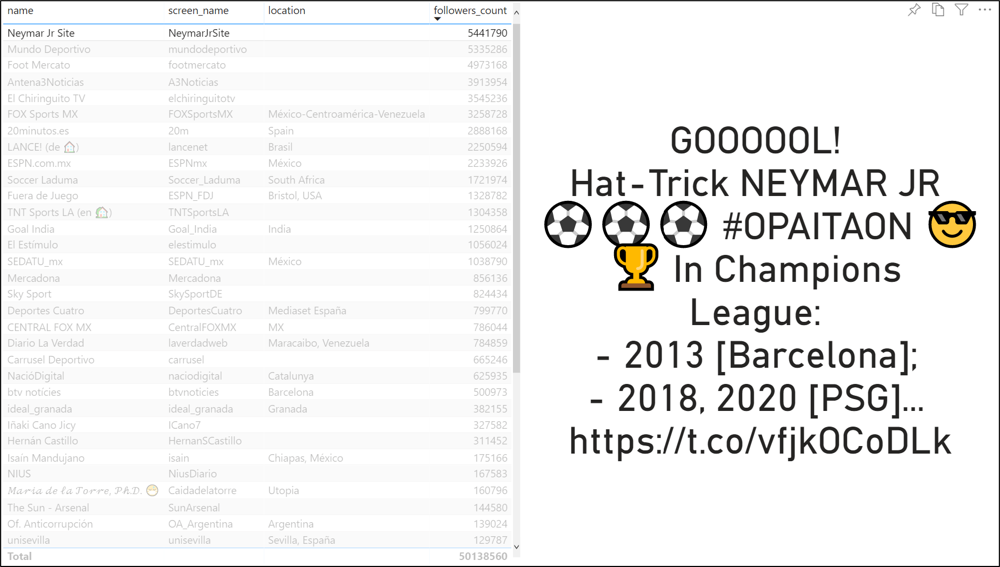

# Module 10 - Power BI Integration

In this advanced module, we will build on top of previous work, including visualizations, more outputs and additional processing steps.

# Index 📚

- [Power BI](#power-bi-)📊
  - [Creating the Detailed View](#creating-the-detailed-view)
  - [Creating the Ranking View](#creating-the-ranking-view)
  - [Creating the Highlighted Users View](#creating-the-highlighted-users-view)
- [Summing Up](#summing-up)
- [Next Steps](#next-steps-)🚶

# Power BI 📊

> ℹ️ **Introduction to Power BI**
> 
> [Power BI](https://powerbi.microsoft.com/en-us/) is a business analytics service by Microsoft. It aims to provide interactive visualizations and business intelligence capabilities with an interface simple enough for end users to create their own reports and dashboards.
>
> To visualize the dataset generated in the project workspace we will need a [Power BI Pro subscription](https://powerbi.microsoft.com/en-us/power-bi-pro/). There is a free trial for 60 days.

## Creating a report in Power BI

In the previous module we defined two Power BI outputs for the Stream Analytics job. Now, we are going to create a Power BI report to visualize the information consumed and processed by our app. The idea is to create a report like this:

_Sample Outcome. Detailed view of each match._

_Sample Outcome. Ranking of all matches._

_Sample Outcome. Highlighted Users (Influencers) View._

We start this module already having the Stream Analytics job running from the previous [module](../09-stream-analytics/readme.md), so we can go to our **Power BI** account and find the generated datasets. We might click on **Create report** (bar chart icon enclosed in the red box) and access a the edition mode for this new report, however we will encounter some problems because the web editor lacks the ability to edit images in the reports.

_Dataset already generated in your Power BI workspace_

Therefore, we will download Power BI desktop editor and proceed that way round. From the top icon bar in your Power BI web editor, click on the arrow pointing down and then on **Power BI Desktop**, this link will led you to downloading the desktop editor on your PC.

 

_Download Power BI desktop_

Once your Power BI desktop has already been setup, you will be welcomed with this page below. Hit **Get data.**

_Power BI desktop initial page_

Now, go to **Power Platform** and choose the **Power BI datasets** options. Then, click **Connect**.

_Get Data from Power Platform_

You will be prompted with a similar popup to the one below, select your dataset from the list and click **Create** to generate your report.

_Select your dataset_

## Creating the Detailed View

Here, we will follow the next steps:

1. Select a **Card** visualization from the Visualizations module and drag the **match_name** column to the Fields placeholder. As a result, the first element from this column will appear in the card.

    

    _Add Card_

2. We can go to the Format tab, turn off the Category label and turn on the Border (besides a lot more of configurations).

    

    _Edit Card's format_

3. Now, we will add a **Slicer** that will allow us to display all the details of each match based on the **match_name** we select.

    

    _Add Slicer_

4. Moving on, we can add more cards. For instance, we will add the home team name, the away team name and the number of match mentions on Twitter. Notice how all the variables show the right match details, according to the one selected in the slicer. Also, we can give a name to the page of the report (like **Matches' Details**).

    

    _Add more Cards_

5. You can continue adding more formatting details to the dashboard (custom titles, borders, etc.), but for simplicity we will go on with more resources. Next, we will include a dynamic image for the home team badge.

>⚠ **Caution**:
>
> The [official documentation](https://docs.microsoft.com/en-us/power-bi/create-reports/power-bi-images-tables) did not prove to be successful here, so we followed this method.

6. Select the **Quick Measure** button from the top toolbar. Then choose the **Concatenated list of values** option from the list and drag the **home_logo** column to the **Field** placeholder. Hit **Ok** and a automatically generated query will appear, click anywhere outside the query to exit that editor. Now, the calculated measure will be available from the Fields list on the right menu.

    

    _Add Quick Measure_

7. Next, click the **New Measure** button and enter this expression: `home_logo_measure = 'matches-table-2'[List of home_logo values]` . Then, change the **Data type** to **Text**, the **Data category** to **Image URL**, and click outside of the Measure tools to go back to the report editing mode.

    

    _Add New Measure_

8. Here we will add a new **Table** visualization, drag the **home_logo_measure** just created to the values field of the table visualization. The team badge will be shown, you can play with the slicer and continue adding the away team badge with the same steps as before. Also, in the **Format** tab of the visualization you can adjust the position, borders and remove the title for the badge.

    

    _Add Table visualization_

9. The only remaining element is a fixed image. You can add one by going to the **Insert** menu, click **Image** and navigate in your explorer to your image. When you select it, it will be shown in the report as well.

    

    _Add static Image_

From now on, you have all the tools and resources to build your own detailed view report based on the sample shown at the beginning of this article. Feel free to use our guideline (including the remaining cards) or edit it as desired adding more visualizations.

## Creating the Ranking View

To create the ranking report, we will hit the **+ button** on the bottom left to add a new page and rename it to something like Matches' Ranking. Then, add a **Funnel** visualization, dragging the **match_name** column to the Group placeholder and the **match_mentions** to the Values placeholder.

_Add Funnel_

As a result, the matches will be ordered by the number of mentions each one has. As before, you can continue adding more funnels (for each metric -favorites, retweets- and for the home and away teams). You can also edit the titles and colors as desired.

>💡 **Hint**:
>
> To add icons/smileys to the titles, try using the shortcut _Windows key + ._ (_dot_) and a contextual menu with icons will be prompted.

## Creating the Highlighted Users View

To create this report, we will need to connect to the corresponding dataset (previously generated as Stream Analytics output).
Please check section [Creating a report in Power BI](#creating-a-report-in-power-bi).

1. Select a **Table** visualization from the Visualizations module and drag the **name**, **screen_name**, **location** and **followers_count** columns to the Values placeholder. As a result, the table will appear in the report.

    

    _Add Influencers' Table_

2. Next, add a **Card** visualization and include the text column in the Fields placeholder. After that, click the combo box to select **First**, this will make the card to display just the first Tweet from that influencer.

    

    _Add Influencers' Card_

3. Finally, you can adjust the size of each component following our sample reference at top of this article, or choose your favorite format customization.

# Summing Up

To sum up we have covered the end to end guide to replicate this application. In this article we have focused on the frontend side, learning the basic elements and tools to generate the visualizations for the data collected and processed in previous stages.
Next, we are going to explore the extra functionality to log all data that was processed for further analysis.

# Next Steps 🚶

Go to [Historical Logging](../11-historical-logging/readme.md)

