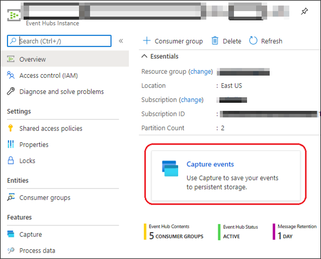
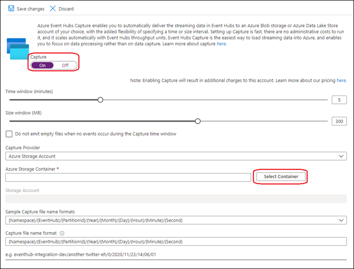
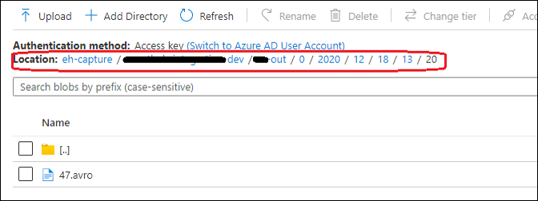
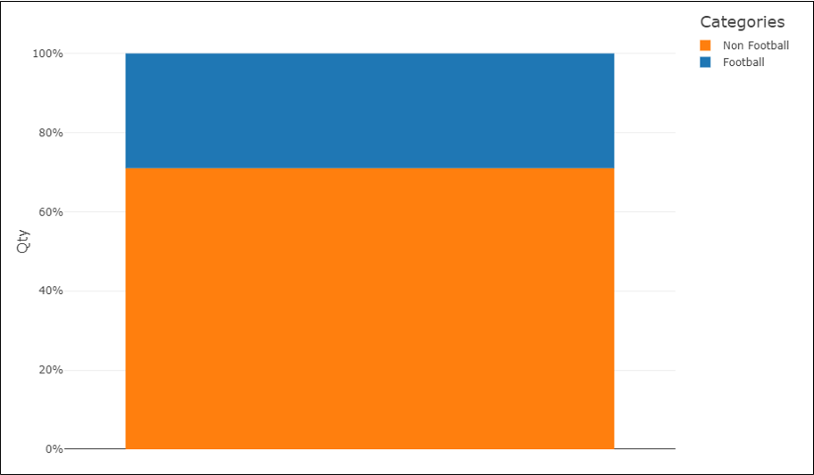
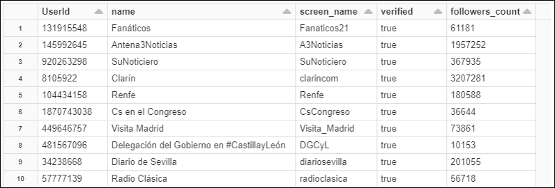

# Module 11 – Historical Logging and Analysis

# Index 📚

- [Event Hub Capture](#event-hub-capture)
- [Enabling Event Hub Capture](#enabling-event-hub-capture)
- [Loading and Analyzing the Data in Databricks](#loading-and-analyzing-the-data-in-databricks)
- [Summing Up](#summing-up)
- [Next Steps 🚶](#next-steps-)

An extra functionality that was added to the _Sporting Events Application_ was the
capability to log all data that was processed for further analysis. This was
done by enabling the _Capture_ feature of _Event Hub_, it writes the events that
passes through it in the _Data Lake_ and can be further loaded for analysis, we
did it using a Databricks Notebook.

## Event Hub Capture

From the [Event Hub documentation](https://docs.microsoft.com/en-us/azure/event-hubs/event-hubs-capture-overview)
we can read that the _Capture_ feature of _Event Hub_ allows to not only process
stream data but to save that data for batch processing, allowing us to store the
data into Azure Storage (Blob and/or Data Lake) in a scalable, fast, easy-to-use
manner with no additional costs.

In fact, any _Event Hub_ can be enabled with the _Capture_ feature, it will place
all events coming into it in the selected storage and we can further make
additional processing from that data. Let us see how easy it is to setup capture
data for an _Event Hub_.

## Enabling Event Hub Capture

For an existing _Event Hub_, follow the next steps to enable events capture:

1.  Go to your _Event Hub_ instance, make sure the Overview item is selected in
    the left pane, then select the card _Capture_ Events:

    

    _Capture events feature of an Event Hub_

2.  In the screen that appears turn on the capture switch, a form will appear to
    set the _Capture_ parameters, leave the other values as default, and click the
    *Select Container* button:

    

    _Capture events setup in an Event Hub_

3.  You will see a _Storage Account_ view showing you the list of all available
    storage accounts, select the one desired and you will see a list of all
    containers within that storage account, select the one that you wish to use
    and click select.

4.  After selecting the container, you will see that the _Access Key_ for the
    container is automatically placed in the _Storage Account_ text box.

5.  You can also select formats for the naming of the files that will be captured, we
    recommend you to leave the default values.

6.  Finally, click the *Save* button in the upper left corner and you’re done with
    the _Capture_ feature. Once the _Event Hub_ starts getting events, those will be
    logged as follows, observe the “directories” structure that was created,
    also note that the files are saved as *AVRO* which is the only supported file
    format for Capture:

    

    _Files captured by an Event Hub_

## Loading and Analyzing the Data in Databricks

There are many things you could do with the captured data, we will show a simple
application here using _Databricks_, let us load the data into a Data Frame and
make some analysis over the data:

1.  In the same _Cluster_ used to analyze the stream, create a new _Notebook_ and place
    the following code in a new cell:

    ```scala
    import org.apache.spark.sql.functions.unbase64

    import org.apache.spark.sql.types.\_

    import org.apache.spark.sql.functions.\_

    val tweetSchema = new StructType()

        .add("user",

            new StructType()

                .add("id_str", StringType)

                .add("name", StringType)

                .add("screen_name", StringType)

                .add("verified", BooleanType)

                .add("followers_count", LongType)

        )

    spark

        .sparkContext

        .hadoopConfiguration

        .set("avro.mapred.ignore.inputs.without.extension", "true")


    spark.conf.set("spark.sql.avro.compression.codec", "deflate")

    spark.conf.set("spark.sql.avro.deflate.level", "5")

    val filesPath = "/your/container/event-hub-workspace/event-hub-name/0/*/*/*/*/*/*.avro"

    //storage-\>avro
    val avroDf = spark.read.format("com.databricks.spark.avro").load(filesPath)

    //avro-\>json
    val jsonDF = avroDf

        .withColumn("json", \$"body".cast("String"))

        .select("json")

    val jsonSchema = spark.read.option("multiline", true).json(jsonDF.as[String])

    val result = jsonSchema

        .withColumn("tweet", from_json(\$"full_tweet".cast(StringType), tweetSchema))

        .select("*", "tweet.user.*")


    display(result)
    ```

2.  Observe that when loading an event, it contains not only the body with the
    fields we sent as part of the event but also has internal control fields
    like *sequence id* and *enqueue datetime*, also the body (the event payload)
    goes _base64_ coded inside the event.

3.  As the events carry out all tweet data, we had to convert the *full_tweet*
    field to _JSON_ using the defined *tweetSchema*, this because we may then get
    some additional information like user’s data.

4.  Observe too that the filesPath has the same pattern as the one specified in
    the Event Hub Capture configuration.

5.  Now, we can make different analysis with that captured data, let's for example
    turn the data into a table:

    ```scala
    result.createOrReplaceTempView("rawEvents")
    ```
6.  Then let us see how many tweets were related to Football and Non-Football:
    ```sql
    %sql

    SELECT DISTINCT(category) AS Categories, COUNT(\*) AS Qty FROM rawEvents

    GROUP BY Categories
    ```
7.  You could generate a graph like this one with the results of that query:

    

    _Graph of Football and Non-Footall tweets for a captured data_

8.  You can use this query to get the verified users with more followers
    (influencers):
    ```sql
    %sql

    SELECT DISTINCT(id_str) AS UserId, name, screen_name, verified,
    followers_count FROM rawEvents WHERE verified = true AND followers_count \>
    10000

    GROUP BY UserId, name, screen_name, verified, followers_count

    ORDER BY followers_count DESC
    ```
9.  You should get a table like this one:

    

    _List of top 10 verified users with more than 10.000 folowwers_

# Summing Up

With this implementation of Capture and Historical Analysis we finalize all the characteristics of the Sporting Events Application. Next, you will find some additional recommendations for features that can take the application even further.

# Next Steps 🚶

Go to [Module 12 - Going Further](../12-going-further/readme.md)
