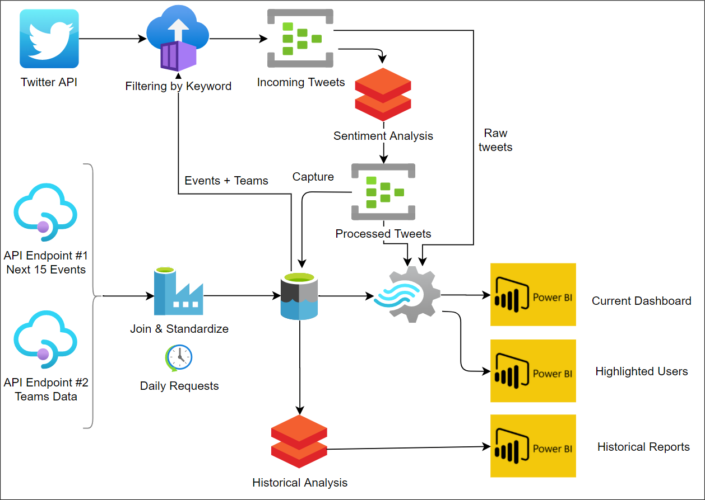
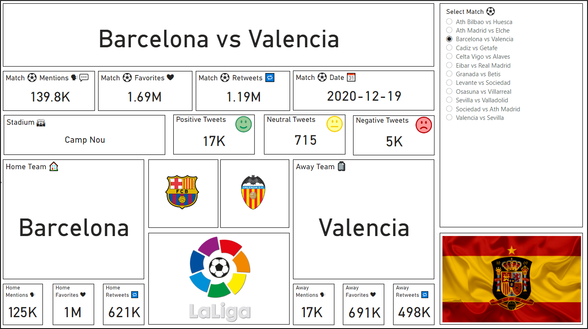

# The sporting events application
A compelling end to end **Data Ingestion, Processing and Visualization** sandbox scenario.

# General Overview 👓

In the following sections, we will work on an application that integrates the different technologies used to process big amounts of data. In only one exercise, we integrate static data obtained from an API endpoint providing sporting events information, with real data provided by the Twitter developer API. Later, we transform the data by using Azure Databricks Notebooks, EventHub, and Stream Analytics services. Finally, the result is presented in a Power BI dashboard.

The intention of this workshop is to explain how to combine the different technologies we have been learning. By using Twitter and an external Football API, we will transform and analyze the data in order to produce a Power BI Dashboard showing the information but from an integrated point of view. The following image shows the architecture of the solution we will be working on:

_The General Architecture of the Integration Process_

The workshop will be divided into six main stages:

- Ingestion of data coming from the external API using **Azure Data Factory**.
- Ingestion of data coming the Twitter developer API using **Azure Container Instances**.
- Integration and Analysis of the data using **Databricks **and** EventHubs**.
- Transformation of the data returned by the two previous stages using **Stream Analytics**.
- Visualization of the results in a **Power BI** dashboard.
- Analysis of historical data using **Databricks**.

_Workshop Outcome Sample_

# General Index 📚

- [Module 1 - Creating an Azure Data Factory](01-data-factory/readme.md)
  - [Creating an ADF](01-data-factory/readme.md#creating-an-adf)
- [Module 2 - Creating a Data Lake storage account](02-data-lake/readme.md)
  - [Creating a Data Lake storage](02-data-lake/readme.md#creating-a-data-lake-storage)
- [Module 3 - Consuming APIs with ADF](03-api/readme.md)
  - [The football API](03-api/readme.md#the-football-api)
  - [Creating the ingestion pipeline](03-api/readme.md#creating-the-ingestion-pipeline)
    - [Creating the connection to the storage resources](03-api/readme.md#creating-the-connection-to-the-storage-resources)
    - [Creating the intermediate datasets](03-api/readme.md#creating-the-intermediate-datasets)
    - [Creating the copy activities](03-api/readme.md#creating-the-copy-activities)
- [Module 4 - Creating the merging dataflow](04-data-flow/readme.md)
  - [Adding a Joining Data Flow](04-data-flow/readme.md#adding-a-joining-data-flow)
- [Module 5 - ACI Application](05-aci-application/readme.md)
  - [C# Application](05-aci-application/readme.md#c#-application)
    - [Description](05-aci-application/readme.md#description)
    - [Obtaining the Keywords](05-aci-application/readme.md#obtaining-the-keywords)
      - [Connect to Data Lake by using an account key](05-aci-application/readme.md#connect-to-data-lake-by-using-an-account-key)
      - [Reading the Keywords](05-aci-application/readme.md#reading-the-keywords)
    - [Getting the Tweets](05-aci-application/readme.md#getting-the-tweets)
      - [Create a Twitter application](05-aci-application/readme.md#create-a-twitter-application)
      - [Fetching the Tweets](05-aci-application/readme.md#fetching-the-tweets)
    - [Associating the Tweets to Events](05-aci-application/readme.md#associating-the-tweets-to-events)
    - [Sending data to Event Hub](05-aci-application/readme.md#sending-data-to-event-hub)
      - [Connecting to Event Hub](05-aci-application/readme.md#connecting-to-event-hub)
      - [Sending events to Event Hub](05-aci-application/readme.md#sending-events-to-event-hub)
    - [Putting all together](05-aci-application/readme.md#putting-all-together)
  - [Deploying in ACI](05-aci-application/readme.md#deploying-in-aci)
    - [Definitions](05-aci-application/readme.md#Definitions)
      - [Azure Container Instances](05-aci-application/readme.md#azure-container-instances)
      - [Azure Container Registry](05-aci-application/readme.md#azure-container-registry)
    - [Creating the Dockerfile](05-aci-application/readme.md#creating-the-dockerfile)
    - [Creating an ACR instance](05-aci-application/readme.md#creating-an-acr-instance)
    - [Uploading and building the project](05-aci-application/readme.md#uploading-and-building-the-project)
- [Module 6 - Text Classification](06-text-classification/readme.md)
  - [Text Classification](06-text-classification/readme.md#text-classification)
  - [Manual Tweets Classification](06-text-classification/readme.md#manual-tweets-classification)
  - [Implementing the algorithm](06-text-classification/readme.md#implementing-the-algorithm)
  - [Accuracy of the algorithm](06-text-classification/readme.md#accuracy-of-the-algorithm)
- [Module 7 - Language Detection](07-language-detection/readme.md)
  - [Azure Cognitive Services](07-language-detection/readme.md#azure-cognitive-services)
  - [Creating a Cognitive Services instance](07-language-detection/readme.md#creating-a-cognitive-services-instance)
  - [Exploring Cognitive Services with Postman](07-language-detection/readme.md#exploring-cognitive-services-with-postman)
  - [Calling the Cognitive Services API from Databricks](07-language-detection/readme.md#calling-the-cognitive-services-api-from-databricks)
- [Module 8 - Sentiment Analysis](08-sentiment-analysis/readme.md)
  - [Performing Sentiment Analysis in Databricks](08-sentiment-analysis/readme.md#performing-sentiment-analysis-in-databricks)
- [Module 9 - Stream Analytics](09-stream-analytics/readme.md)
  - [Stream Analytics Data Transformation](09-stream-analytics/readme.md#stream-analytics-data-transformation)
    - [Defining the Inputs](09-stream-analytics/readme.md#defining-the-inputs)
      - [Adding the Static Data Input](09-stream-analytics/readme.md#adding-the-static-data-input)
      - [Adding the Processed Stream Data Input](09-stream-analytics/readme.md#adding-the-processed-stream-data-input)
      - [Adding the Raw Stream Data Input](09-stream-analytics/readme.md#adding-the-raw-stream-data-input)
    - [Defining the Events Output](09-stream-analytics/readme.md#defining-the-events-output)
    - [Defining the Highlighted Users Output](09-stream-analytics/readme.md#defining-the-highlighted-users-output)
    - [Performing the Transformation](09-stream-analytics/readme.md#performing-the-transformation)
- [Module 10 - Power BI Integration](10-power-bi/readme.md)
  - [Power BI](10-power-bi/readme.md#power-bi-)
    - [Creating the Detailed View](10-power-bi/readme.md#creating-the-detailed-view)
    - [Creating the Ranking View](10-power-bi/readme.md#creating-the-ranking-view)
    - [Creating the Highlighted Users View](10-power-bi/readme.md#creating-the-highlighted-users-view)
- [Module 11 - Historical Logging and Analysis](11-historical-logging/readme.md)
  - [Event Hub Capture](11-historical-logging/readme.md#event-hub-capture)
  - [Enabling Event Hub Capture](11-historical-logging/readme.md#enabling-event-hub-capture)
  - [Loading and Analyzing the Data in Databricks](11-historical-logging/readme.md#loading-and-analyzing-the-data-in-databricks)
- [Module 12 - Going further](12-going-further/readme.md)

Let's start creating the different resources of our integration sample.

# Feedback 🗣️

**What happens if I have any question/feedback?**
If anything comes up or you have some feedback to give, you can contact us and/or issue a pull request.

Please, **feel free to reach us out** so we can improve the workshop as a community for new attendees to have a better experience!

# Authors 🖋️

- [Lucas Abella](https://github.com/LucasGabriel29)
- [Mateo Cannata](https://github.com/CannataMateo)
- [Gabriela Gutierrez](https://github.com/xdcarp)
- [Mariano Iglesias](https://github.com/MarianoAIglesias1994)
- [Diego Satizabal](https://github.com/dsatizabalsw)

# Next Steps 🚶

Go to [Module 1 - Creating an Azure Data Factory](01-data-factory/readme.md)
